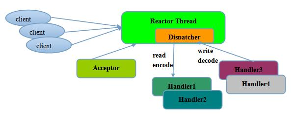

## Netty

#### 1.介绍

Netty是由JBOSS提供的一个java开源框架。

Netty是一个高性能、异步事件驱动的NIO框架，它提供了对TCP、UDP和文件传输的支持。作为当前最流行的NIO框架，Netty在互联网领域、大数据分布式计算领域、游戏行业、通信行业等获得了广泛的应用，一些业界著名的开源组件也基于Netty的NIO框架构建(文章尾有详细介绍)。

#### 2.Netty的特点

- 高并发   
Netty是一款基于NIO（Nonblocking I/O，非阻塞IO）开发的网络通信框架，对比于BIO（Blocking I/O，阻塞IO），他的并发性能得到了很大提高 。

- 传输快   
Netty的传输快其实也是依赖了NIO的一个特性——零拷贝。

- 封装好   
Netty封装了NIO操作的很多细节，提供易于使用的API。

#### 为什么选择Netty
JDK 原生也有一套网络应用程序 API，但是存在一系列问题，主要如下：

1) NIO 的类库和 API 繁杂，使用麻烦：你需要熟练掌握 Selector、ServerSocketChannel、SocketChannel、ByteBuffer 等。

2) 需要具备其他的额外技能做铺垫：例如熟悉 Java 多线程编程，因为 NIO 编程涉及到 Reactor 模式，你必须对多线程和网路编程非常熟悉，才能编写出高质量的 NIO 程序。

3) 可靠性能力补齐，开发工作量和难度都非常大：例如客户端面临断连重连、网络闪断、半包读写、失败缓存、网络拥塞和异常码流的处理等等。NIO 编程的特点是功能开发相对容易，但是可靠性能力补齐工作量和难度都非常大。

4) JDK NIO 的 Bug：例如臭名昭著的 Epoll Bug，它会导致 Selector 空轮询，最终导致 CPU 100%。     
官方声称在 JDK1.6 版本的 update 18 修复了该问题，但是直到 JDK 1.7 版本该问题仍旧存在，只不过该 Bug
发生概率降低了一些而已，它并没有被根本解决。

#### Netty框架的优势
    API使用简单，开发门槛低；
    功能强大，预置了多种编解码功能，支持多种主流协议；
    定制能力强，可以通过ChannelHandler对通信框架进行灵活地扩展；
    性能高，通过与其他业界主流的NIO框架对比，Netty的综合性能最优；
    成熟、稳定，Netty修复了已经发现的所有JDK NIO BUG，业务开发人员不需要再为NIO的BUG而烦恼；
    社区活跃，版本迭代周期短，发现的BUG可以被及时修复，同时，更多的新功能会加入；
    经历了大规模的商业应用考验，质量得到验证。
    在互联网、大数据、网络游戏、企业应用、电信软件等众多行业得到成功商用，证明了它已经完全能够满足不同行业的商业应用了。
#### Netty的架构设计
##### 总体结构

Netty 采用了比较典型的三层网络架构进行设计，逻辑架构图如下所示：

1) 传输服务：支持 BIO 和 NIO；

2) 容器集成：支持 OSGI、JBossMC、Spring、Guice 容器；

3) 协议支持：HTTP、Protobuf、二进制、文本、WebSocket 等一系列常见协议都支持。还支持通过实行编码解码逻辑来实现自定义协议；

4) Core 核心：可扩展事件模型、通用通信 API、支持零拷贝的 ByteBuf 缓冲对象。

### Netty的高性能设计
#### 1.高性能的三大要素

1) 传输：用什么样的通道将数据发送给对方，BIO、NIO或者AIO，IO模型在很大程度上决定了框架的性能。

2) 协议：采用什么样的通信协议，HTTP或者内部私有协议。协议的选择不同，性能模型也不同。相比于公有协议，内部私有协议的性能通常可以被设计的更优。

3) 线程：数据报如何读取？读取之后的编解码在哪个线程进行，编解码后的消息如何派发，Reactor线程模型的不同，对性能的影响也非常大。

#### 2.IO模型

Netty的I/O模型基于非阻塞I/O实现，底层依赖的是JDK NIO框架的Selector。

#### 3.Reactor线程模型

关于Java NIO 构造Reator模式，Doug lea在《Scalable IO in Java》中给了很好的阐述，这里截取PPT对Reator模式的实现进行说明。

1) Reactor单线程模型：Reactor单线程模型，指的是所有的I/O操作都在同一个NIO线程上面完成。对于一些小容量应用场景，可以使用单线程模型。

2) Reactor多线程模型：Rector多线程模型与单线程模型最大的区别就是有一组NIO线程处理I/O操作。主要用于高并发、大业务量场景。

3)主从Reactor多线程模型：主从Reactor线程模型的特点是服务端用于接收客户端连接的不再是个1个单独的NIO线程，而是一个独立的NIO线程池。利用主从NIO线程模型，可以解决1个服务端监听线程无法有效处理所有客户端连接的性能不足问题。

#### 4.Netty的线程模型

说完了Reactor的三种模型，那么Netty是哪一种呢？其实Netty的线程模型是Reactor模型的变种，那就是去掉线程池的第三种形式的变种，这也是Netty NIO的默认模式。

### Netty的核心组件
#### Netty应用中必不可少的组件：

- Bootstrap or ServerBootstrap
- EventLoop
- EventLoopGroup
- ChannelPipeline
- Channel
- Future or ChannelFuture
- ChannelInitializer
- ChannelHandler

#### 1.Bootstrap

一个Netty应用通常由一个Bootstrap开始，它主要作用是配置整个Netty程序，串联起各个组件。

Handler，为了支持各种协议和处理数据的方式，便诞生了Handler组件。Handler主要用来处理各种事件，这里的事件很广泛，比如可以是连接、数据接收、异常、数据转换等。

#### 2.ChannelInboundHandler

一个最常用的Handler。这个Handler的作用就是处理接收到数据时的事件，也就是说，我们的业务逻辑一般就是写在这个Handler里面的，ChannelInboundHandler就是用来处理我们的核心业务逻辑。

#### 3.ChannelInitializer

当一个链接建立时，我们需要知道怎么来接收或者发送数据，当然，我们有各种各样的Handler实现来处理它，那么ChannelInitializer便是用来配置这些Handler，它会提供一个ChannelPipeline，并把Handler加入到ChannelPipeline。

#### 4.ChannelPipeline

一个Netty应用基于ChannelPipeline机制，这种机制需要依赖于EventLoop和EventLoopGroup，因为它们三个都和事件或者事件处理相关。

EventLoops的目的是为Channel处理IO操作，一个EventLoop可以为多个Channel服务。

EventLoopGroup会包含多个EventLoop。

#### 5.Channel

代表了一个Socket链接，或者其它和IO操作相关的组件，它和EventLoop一起用来参与IO处理。

#### 6.Future

在Netty中所有的IO操作都是异步的，因此，你不能立刻得知消息是否被正确处理，但是我们可以过一会等它执行完成或者直接注册一个监听，具体的实现就是通过Future和ChannelFutures,他们可以注册一个监听，当操作执行成功或失败时监听会自动触发。

总之，所有的操作都会返回一个ChannelFuture。

### Netty的应用场景
#### 1.互联网行业

在分布式系统中，各个节点之间需要远程服务调用，高性能的RPC框架必不可少，Netty作为异步高新能的通信框架,往往作为基础通信组件被这些RPC框架使用。

典型的应用有：阿里分布式服务框架Dubbo的RPC框架使用Dubbo协议进行节点间通信，Dubbo协议默认使用Netty作为基础通信组件，用于实现各进程节点之间的内部通信。

除了 Dubbo 之外，淘宝的消息中间件 RocketMQ 的消息生产者和消息消费者之间，也采用 Netty 进行高性能、异步通信。

#### 2.游戏行业

无论是手游服务端还是大型的网络游戏，Java语言得到了越来越广泛的应用。Netty作为高性能的基础通信组件，它本身提供了TCP/UDP和HTTP协议栈。

非常方便定制和开发私有协议栈，账号登录服务器，地图服务器之间可以方便的通过Netty进行高性能的通信

#### 3.大数据领域

经典的Hadoop的高性能通信和序列化组件Avro的RPC框架，默认采用Netty进行跨界点通信，它的Netty Service基于Netty框架二次封装实现。