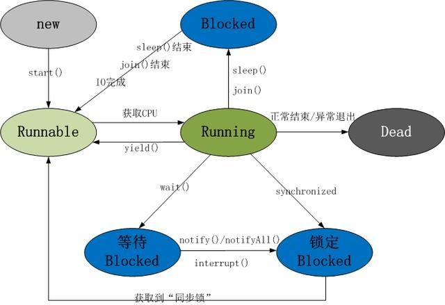

 ## 多线程
 
 
#### 1、并发编程三要素？
 
 1. 原子性     
 原子性指的是一个或者多个操作，要么全部执行并且在执行的过程中不被其他操作打断，要么就全部都不执行。
 
 2. 可见性     
 可见性指多个线程操作一个共享变量时，其中一个线程对变量进行修改后，其他线程可以立即看到修改的结果。  
 实现可见性的方法：  
 synchronized或者Lock：保证同一个时刻只有一个线程获取锁执行代码，锁释放之前把最新的值刷新到主内存，实现可见性。
 
 3. 有序性     
 有序性，即程序的执行顺序按照代码的先后顺序来执行。
 
#### 2、多线程的价值？
 
 1. 发挥多核CPU的优势   
 多线程，可以真正发挥出多核CPU的优势来，达到充分利用CPU的目的，采用多线程的方式去同时完成几件事情而不互相干扰。


 2. 防止阻塞    
 从程序运行效率的角度来看，单核CPU不但不会发挥出多线程的优势，反而会因为在单核CPU上运行多线程导致线程上下文的切换，而降低程序整体的效率。但是单核CPU我们还是要应用多线程，就是为了防止阻塞。试想，如果单核CPU使用单线程，那么只要这个线程阻塞了，比方说远程读取某个数据吧，对端迟迟未返回又没有设置超时时间，那么你的整个程序在数据返回回来之前就停止运行了。多线程可以防止这个问题，多条线程同时运行，哪怕一条线程的代码执行读取数据阻塞，也不会影响其它任务的执行。
 
 3. 便于建模    
 这是另外一个没有这么明显的优点了。假设有一个大的任务A，单线程编程，那么就要考虑很多，建立整个程序模型比较麻烦。但是如果把这个大的任务A分解成几个小任务，任务B、任务C、任务D，分别建立程序模型，并通过多线程分别运行这几个任务，那就简单很多了。
 
#### 3、创建线程的有哪些方式？
 
 1. 继承Thread类创建线程类
 
 2. 通过Runnable接口创建线程类
 
 3. 通过Callable和Future创建线程
 
#### 4.创建线程的三种方式的对比？
 
 1. 采用实现Runnable、Callable接口的方式创建多线程。    
 优势是：   
 线程类只是实现了Runnable接口或Callable接口，还可以继承其他类。
 在这种方式下，多个线程可以共享同一个target对象，所以非常适合多个相同线程来处理同一份资源的情况，从而可以将CPU、代码和数据分开，形成清晰的模型，较好地体现了面向对象的思想。     
 劣势是：   
 编程稍微复杂，如果要访问当前线程，则必须使用Thread.currentThread()方法。    
 
 2. 使用继承Thread类的方式创建多线程     
 优势是：   
 编写简单，如果需要访问当前线程，则无需使用Thread.currentThread()方法，直接使用this即可获得当前线程。    
 劣势是：   
 线程类已经继承了Thread类，所以不能再继承其他父类。   
 
 3. Runnable和Callable的区别
  Callable规定（重写）的方法是call()，Runnable规定（重写）的方法是run()。 
  Callable的任务执行后可返回值，而Runnable的任务是不能返回值的。   
  Call方法可以抛出异常，run方法不可以。    
  运行Callable任务可以拿到一个Future对象，表示异步计算的结果。它提供了检查计算是否完成的方法，以等待计算的完成，并检索计算的结果。通过Future对象可以了解任务执行情况，可取消任务的执行，还可获取执行结果。    
 
#### 5、线程的状态流转图
 
 线程的生命周期及五种基本状态：
 
 
 
 Java线程具有五中基本状态
 
 1. 新建状态（New）：当线程对象对创建后，即进入了新建状态，如：Thread t = new MyThread();
 
 2. 就绪状态（Runnable）：当调用线程对象的start()方法（t.start();），线程即进入就绪状态。处于就绪状态的线程，只是说明此线程已经做好了准备，随时等待CPU调度执行，并不是说执行了t.start()此线程立即就会执行；
 
 3. 运行状态（Running）：当CPU开始调度处于就绪状态的线程时，此时线程才得以真正执行，即进入到运行状态。注：就 绪状态是进入到运行状态的唯一入口，也就是说，线程要想进入运行状态执行，首先必须处于就绪状态中；
 
 4. 阻塞状态（Blocked）：处于运行状态中的线程由于某种原因，暂时放弃对CPU的使用权，停止执行，此时进入阻塞状态，直到其进入到就绪状态，才 有机会再次被CPU调用以进入到运行状态。根据阻塞产生的原因不同，阻塞状态又可以分为三种：
 
    1. 等待阻塞：运行状态中的线程执行wait()方法，使本线程进入到等待阻塞状态；
 
    2. 同步阻塞 — 线程在获取synchronized同步锁失败(因为锁被其它线程所占用)，它会进入同步阻塞状态；
 
    3. 其他阻塞 — 通过调用线程的sleep()或join()或发出了I/O请求时，线程会进入到阻塞状态。当sleep()状态超时、join()等待线程终止或者超时、或者I/O处理完毕时，线程重新转入就绪状态。
 
 5. 死亡状态（Dead）：线程执行完了或者因异常退出了run()方法，该线程结束生命周期。
 
#### 6.什么是线程池？ 有哪几种创建方式？
 
 线程池就是提前创建若干个线程，如果有任务需要处理，线程池里的线程就会处理任务，处理完之后线程并不会被销毁，而是等待下一个任务。由于创建和销毁线程都是消耗系统资源的，所以当你想要频繁的创建和销毁线程的时候就可以考虑使用线程池来提升系统的性能。
 
 java 提供了一个 java.util.concurrent.Executor接口的实现用于创建线程池。
 
 四种线程池的创建：
 
 1. newCachedThreadPool创建一个可缓存线程池
 
 2. newFixedThreadPool 创建一个定长线程池，可控制线程最大并发数。
 
 3. newScheduledThreadPool 创建一个定长线程池，支持定时及周期性任务执行。
 
 4. newSingleThreadExecutor 创建一个单线程化的线程池，它只会用唯一的工作线程来执行任务。
 
 
#### 7.线程池的优点？
 
 1. 重用存在的线程，减少对象创建销毁的开销。
 
 2. 可有效的控制最大并发线程数，提高系统资源的使用率，同时避免过多资源竞争，避免堵塞。
 
 3. 提供定时执行、定期执行、单线程、并发数控制等功能。
 
 
 
#### 8.Java中的同步集合与并发集合有什么区别？
 
 同步集合类：
-  Vector
-  Stack
-  HashTable
-  Collections.synchronized方法生成
 
 并发集合类：
 
-  ConcurrentHashMap
-  CopyOnWriteArrayList
-  CopyOnWriteArraySet等
 
#### 9.同步集合与并发集合的区别
 
 同步集合与并发集合都为多线程和并发提供了合适的线程安全的集合，不过并发集合的可扩展性更高。同步集合比并发集合会慢得多，主要原因是锁，同步集合会对整个May或List加锁，而并发集合例如ConcurrentHashMap，
 把整个Map 划分成几个片段，只对相关的几个片段上锁，同时允许多线程访问其他未上锁的片段(JDK1.8版本底层加入了红黑树)。
 
#### 10.常用的并发工具类有哪些？
 
-  CountDownLatch
-  CyclicBarrier
-  Semaphore
-  Exchanger
 
#### 11.CyclicBarrier和CountDownLatch的应用场景？
 
- CountDownLatch : 一个线程(或者多个)， 等待另外N个线程完成某个事情之后才能执行。 
 
- CyclicBarrier : N个线程相互等待，任何一个线程完成之前，所有的线程都必须等待。
 
 CountDownLatch的使用场景：
 
 在一些应用场合中，需要等待某个条件达到要求后才能做后面的事情；同时当线程都完成后也会触发事件，以便进行后面的操作, 这个时候就可以使用CountDownLatch。
 
 CyclicBarrier 使用场景
 
 CyclicBarrier可以用于多线程计算数据，最后合并计算结果的应用场景。
 
 #### 12.CyclicBarrier和CountDownLatch的区别
 
 1. CountDownLatch简单的说就是一个线程等待，直到他所等待的其他线程都执行完成并且调用countDown()方法发出通知后，当前线程才可以继续执行。
 
 2. cyclicBarrier是所有线程都进行等待，直到所有线程都准备好进入await()方法之后，所有线程同时开始执行！
 
 3. CountDownLatch的计数器只能使用一次。而CyclicBarrier的计数器可以使用reset() 方法重置。所以CyclicBarrier能处理更为复杂的业务场景，比如如果计算发生错误，可以重置计数器，并让线程们重新执行一次。
 
 4. CyclicBarrier还提供其他有用的方法，比如getNumberWaiting方法可以获得CyclicBarrier阻塞的线程数量。isBroken方法用来知道阻塞的线程是否被中断。如果被中断返回true，否则返回false。
 
 
 
#### 13.synchronized的作用？
 
 在Java中，synchronized关键字是用来控制线程同步的，就是在多线程的环境下，控制synchronized代码段不被多个线程同时执行。
 
 synchronized既可以加在一段代码上，也可以加在方法上。
 
 
 
#### 14.volatile关键字的作用
 
 对于可见性，Java提供了volatile关键字来保证可见性。
 
 当一个共享变量被volatile修饰时，它会保证修改的值会立即被更新到主存，当有其他线程需要读取时，它会去内存中读取新值。
 
 从实践角度而言，volatile的一个重要作用就是和CAS结合，保证了原子性，详细的可以参见java.util.concurrent.atomic包下的类，比如AtomicInteger。
 
#### 15.什么是CAS
 
 CAS是compare and swap的缩写，即我们所说的比较交换。
 
 cas是一种基于锁的操作，而且是乐观锁。在java中锁分为乐观锁和悲观锁。悲观锁是将资源锁住，等一个之前获得锁的线程释放锁之后，下一个线程才可以访问。而乐观锁采取了一种宽泛的态度，通过某种方式不加锁来处理资源，比如通过给记录加version来获取数据，性能较悲观锁有很大的提高。
 
 CAS
 操作包含三个操作数 —— 内存位置（V）、预期原值（A）和新值(B)。如果内存地址里面的值和A的值是一样的，那么就将内存里面的值更新成B。CAS是通过无限循环来获取数据的，若果在第一轮循环中，a线程获取地址里面的值被b线程修改了，那么a线程需要自旋，到下次循环才有可能机会执行。
 
 java.util.concurrent.atomic 包下的类大多是使用CAS操作来实现的( AtomicInteger,AtomicBoolean,AtomicLong)。
 
#### 16. CAS的问题
 
 1. CAS容易造成ABA问题。一个线程a将数值改成了b，接着又改成了a，此时CAS认为是没有变化，其实是已经变化过了，而这个问题的解决方案可以使用版本号标识，每操作一次version加1。在java5中，已经提供了AtomicStampedReference来解决问题。
 
 2. 不能保证代码块的原子性     
 CAS机制所保证的知识一个变量的原子性操作，而不能保证整个代码块的原子性。比如需要保证3个变量共同进行原子性的更新，就不得不使用synchronized了。
 
 3. CAS造成CPU利用率增加。之前说过了CAS里面是一个循环判断的过程，如果线程一直没有获取到状态，cpu资源会一直被占用。
 
#### 17.什么是Future？
 
 在并发编程中，我们经常用到非阻塞的模型，在之前的多线程的三种实现中，不管是继承thread类还是实现runnable接口，都无法保证获取到之前的执行结果。通过实现Callback接口，并用Future可以来接收多线程的执行结果。
 
 Future表示一个可能还没有完成的异步任务的结果，针对这个结果可以添加Callback以便在任务执行成功或失败后作出相应的操作。
 
#### 18.什么是AQS
 
 AQS是AbustactQueuedSynchronizer的简称，它是一个Java提高的底层同步工具类，用一个int类型的变量表示同步状态，并提供了一系列的CAS操作来管理这个同步状态。
 
 AQS是一个用来构建锁和同步器的框架，使用AQS能简单且高效地构造出应用广泛的大量的同步器，比如我们提到的ReentrantLock，Semaphore，其他的诸如ReentrantReadWriteLock，SynchronousQueue，FutureTask等等皆是基于AQS的。
 
 AQS支持两种同步方式：
 
 1.独占式
 
 2.共享式
 
 这样方便使用者实现不同类型的同步组件，独占式如ReentrantLock，共享式如Semaphore，CountDownLatch，组合式的如ReentrantReadWriteLock。总之，AQS为使用提供了底层支撑，如何组装实现，使用者可以自由发挥。
 
#### 19.ReadWriteLock是什么
 
 首先明确一下，不是说ReentrantLock不好，只是ReentrantLock某些时候有局限。如果使用ReentrantLock，可能本身是为了防止线程A在写数据、线程B在读数据造成的数据不一致，但这样，如果线程C在读数据、线程D也在读数据，读数据是不会改变数据的，没有必要加锁，但是还是加锁了，降低了程序的性能。
 
 因为这个，才诞生了读写锁ReadWriteLock。ReadWriteLock是一个读写锁接口，ReentrantReadWriteLock是ReadWriteLock接口的一个具体实现，实现了读写的分离，读锁是共享的，写锁是独占的，读和读之间不会互斥，读和写、写和读、写和写之间才会互斥，提升了读写的性能。
 
#### 20.FutureTask是什么
 
 这个其实前面有提到过，FutureTask表示一个异步运算的任务。FutureTask里面可以传入一个Callable的具体实现类，可以对这个异步运算的任务的结果进行等待获取、判断是否已经完成、取消任务等操作。当然，由于FutureTask也是Runnable接口的实现类，所以FutureTask也可以放入线程池中。
 
#### 21.synchronized和ReentrantLock的区别
 
 synchronized是和if、else、for、while一样的关键字，ReentrantLock是类，这是二者的本质区别。既然ReentrantLock是类，那么它就提供了比synchronized更多更灵活的特性，可以被继承、可以有方法、可以有各种各样的类变量，ReentrantLock比synchronized的扩展性体现在几点上：
 
 1. ReentrantLock可以对获取锁的等待时间进行设置，这样就避免了死锁
 
 2. ReentrantLock可以获取各种锁的信息
 
 3. ReentrantLock可以灵活地实现多路通知
 
另外，二者的锁机制其实也是不一样的。ReentrantLock底层调用的是Unsafe的park方法加锁，synchronized操作的应该是对象头中mark word，这点我不能确定。
 
#### 22.什么是乐观锁和悲观锁
 
 （1）乐观锁：就像它的名字一样，对于并发间操作产生的线程安全问题持乐观状态，乐观锁认为竞争不总是会发生，因此它不需要持有锁，将比较-替换这两个动作作为一个原子操作尝试去修改内存中的变量，如果失败则表示发生冲突，那么就应该有相应的重试逻辑。
 
 （2）悲观锁：还是像它的名字一样，对于并发间操作产生的线程安全问题持悲观状态，悲观锁认为竞争总是会发生，因此每次对某资源进行操作时，都会持有一个独占的锁，就像synchronized，不管三七二十一，直接上了锁就操作资源了。
 
#### 23.线程B怎么知道线程A修改了变量
```` 
  volatile修饰变量
  synchronized修饰修改变量的方法
  wait/notify
  while轮询
 ```` 
#### 24.synchronized、volatile、CAS比较
 
  synchronized是悲观锁，属于抢占式，会引起其他线程阻塞。     
  volatile提供多线程共享变量可见性和禁止指令重排序优化。       
  CAS是基于冲突检测的乐观锁（非阻塞）   
#### 25.sleep方法和wait方法有什么区别?
 
 这个问题常问，sleep方法和wait方法都可以用来放弃CPU一定的时间，不同点在于如果线程持有某个对象的监视器，sleep方法不会放弃这个对象的监视器，wait方法会放弃这个对象的监视器
 
#### 26.ThreadLocal是什么？有什么用？
 
 ThreadLocal是一个本地线程副本变量工具类。主要用于将私有线程和该线程存放的副本对象做一个映射，各个线程之间的变量互不干扰，在高并发场景下，可以实现无状态的调用，特别适用于各个线程依赖不通的变量值完成操作的场景。
 
 简单说ThreadLocal就是一种以空间换时间的做法，在每个Thread里面维护了一个以开地址法实现的ThreadLocal.ThreadLocalMap，把数据进行隔离，数据不共享，自然就没有线程安全方面的问题了。
 
#### 27.为什么wait()方法和notify()/notifyAll()方法要在同步块中被调用
 
 这是JDK强制的，wait()方法和notify()/notifyAll()方法在调用前都必须先获得对象的锁
 
#### 28.多线程同步有哪几种方法？
 
 Synchronized关键字，Lock锁实现，分布式锁等。
 
#### 29.线程的调度策略
 
 线程调度器选择优先级最高的线程运行，但是，如果发生以下情况，就会终止线程的运行：
 
 （1）线程体中调用了yield方法让出了对cpu的占用权利
 
 （2）线程体中调用了sleep方法使线程进入睡眠状态
 
 （3）线程由于IO操作受到阻塞
 
 （4）另外一个更高优先级线程出现
 
 （5）在支持时间片的系统中，该线程的时间片用完
 
#### 30.ConcurrentHashMap的并发度是什么
 
 ConcurrentHashMap的并发度就是segment的大小，默认为16，这意味着最多同时可以有16条线程操作ConcurrentHashMap，这也是ConcurrentHashMap对Hashtable的最大优势，任何情况下，Hashtable能同时有两条线程获取Hashtable中的数据吗？
 
#### 31.Java死锁以及如何避免？
 
 Java中的死锁是一种编程情况，其中两个或多个线程被永久阻塞，Java死锁情况出现至少两个线程和两个或更多资源。
 
 Java发生死锁的根本原因是：在申请锁时发生了交叉闭环申请。
 
 死锁的原因
 
 1）是多个线程涉及到多个锁，这些锁存在着交叉，所以可能会导致了一个锁依赖的闭环。
 
 例如：线程在获得了锁A并且没有释放的情况下去申请锁B，这时，另一个线程已经获得了锁B，在释放锁B之前又要先获得锁A，因此闭环发生，陷入死锁循环。
 
 2）默认的锁申请操作是阻塞的。
 
 所以要避免死锁，就要在一遇到多个对象锁交叉的情况，就要仔细审查这几个对象的类中的所有方法，是否存在着导致锁依赖的环路的可能性。 总之是尽量避免在一个同步方法中调用其它对象的延时方法和同步方法。
 
#### 32.怎么唤醒一个阻塞的线程
 
 如果线程是因为调用了wait()、sleep()或者join()方法而导致的阻塞，可以中断线程，并且通过抛出InterruptedException来唤醒它；如果线程遇到了IO阻塞，无能为力，因为IO是操作系统实现的，Java代码并没有办法直接接触到操作系统。
 
#### 33.不可变对象对多线程有什么帮助
 
 前面有提到过的一个问题，不可变对象保证了对象的内存可见性，对不可变对象的读取不需要进行额外的同步手段，提升了代码执行效率。
 
####  34.什么是多线程的上下文切换
 
 多线程的上下文切换是指CPU控制权由一个已经正在运行的线程切换到另外一个就绪并等待获取CPU执行权的线程的过程。
 
####  35.如果你提交任务时，线程池队列已满，这时会发生什么
 
 这里区分一下：
 
  如果使用的是无界队列LinkedBlockingQueue，也就是无界队列的话，没关系，继续添加任务到阻塞队列中等待执行，因为LinkedBlockingQueue可以近乎认为是一个无穷大的队列，可以无限存放任务    
  
  如果使用的是有界队列比如ArrayBlockingQueue，任务首先会被添加到ArrayBlockingQueue中，ArrayBlockingQueue满了，会根据maximumPoolSize的值增加线程数量，如果增加了线程数量还是处理不过来，ArrayBlockingQueue继续满，那么则会使用拒绝策略RejectedExecutionHandler处理满了的任务，默认是AbortPolicy   
  
#### 36.Java中用到的线程调度算法是什么
 
 抢占式。一个线程用完CPU之后，操作系统会根据线程优先级、线程饥饿情况等数据算出一个总的优先级并分配下一个时间片给某个线程执行。
 
#### 37.什么是线程调度器(Thread Scheduler)和时间分片(Time Slicing)？
 
 线程调度器是一个操作系统服务，它负责为Runnable状态的线程分配CPU时间。一旦我们创建一个线程并启动它，它的执行便依赖于线程调度器的实现。时间分片是指将可用的CPU时间分配给可用的Runnable线程的过程。分配CPU时间可以基于线程优先级或者线程等待的时间。线程调度并不受到Java虚拟机控制，所以由应用程序来控制它是更好的选择（也就是说不要让你的程序依赖于线程的优先级）。
 
#### 38.Java Concurrency API中的Lock接口(Lock interface)是什么？对比同步它有什么优势？
 
 Lock接口比同步方法和同步块提供了更具扩展性的锁操作。他们允许更灵活的结构，可以具有完全不同的性质，并且可以支持多个相关类的条件对象。
 
 它的优势有：
 
  可以使锁更公平   
  可以使线程在等待锁的时候响应中断  
  可以让线程尝试获取锁，并在无法获取锁的时候立即返回或者等待一段时间     
  可以在不同的范围，以不同的顺序获取和释放锁     
#### 39.单例模式的线程安全性
 
 老生常谈的问题了，首先要说的是单例模式的线程安全意味着：某个类的实例在多线程环境下只会被创建一次出来。单例模式有很多种的写法，我总结一下：
 
 （1）饿汉式单例模式的写法：线程安全
 
 （2）懒汉式单例模式的写法：非线程安全
 
 （3）双检锁单例模式的写法：线程安全
 
#### 40.Semaphore有什么作用
 
 Semaphore就是一个信号量，它的作用是限制某段代码块的并发数。Semaphore有一个构造函数，可以传入一个int型整数n，表示某段代码最多只有n个线程可以访问，如果超出了n，那么请等待，等到某个线程执行完毕这段代码块，下一个线程再进入。由此可以看出如果Semaphore构造函数中传入的int型整数n=1，相当于变成了一个synchronized了。
 
#### 41.Executors类是什么？
 
 Executors为Executor，ExecutorService，ScheduledExecutorService，ThreadFactory和Callable类提供了一些工具方法。
 
 Executors可以用于方便的创建线程池
 
#### 42.线程类的构造方法、静态块是被哪个线程调用的
 
 这是一个非常刁钻和狡猾的问题。请记住：线程类的构造方法、静态块是被new这个线程类所在的线程所调用的，而run方法里面的代码才是被线程自身所调用的。
 
 如果说上面的说法让你感到困惑，那么我举个例子，假设Thread2中new了Thread1，main函数中new了Thread2，那么：
 
 （1）Thread2的构造方法、静态块是main线程调用的，Thread2的run()方法是Thread2自己调用的
 
 （2）Thread1的构造方法、静态块是Thread2调用的，Thread1的run()方法是Thread1自己调用的
 
#### 43.同步方法和同步块，哪个是更好的选择
 
 同步块，这意味着同步块之外的代码是异步执行的，这比同步整个方法更提升代码的效率。请知道一条原则：同步的范围越小越好。
 
#### 44.Java线程数过多会造成什么异常？
 
 1)线程的生命周期开销非常高
 
 2)消耗过多的CPU资源
 
 如果可运行的线程数量多于可用处理器的数量，那么有线程将会被闲置。大量空闲的线程会占用许多内存，给垃圾回收器带来压力，而且大量的线程在竞争CPU资源时还将产生其他性能的开销。
 
 3)降低稳定性
 
 JVM在可创建线程的数量上存在一个限制，这个限制值将随着平台的不同而不同，并且承受着多个因素制约，包括JVM的启动参数、Thread构造函数中请求栈的大小，以及底层操作系统对线程的限制等。如果破坏了这些限制，那么可能抛出OutOfMemoryError异常。