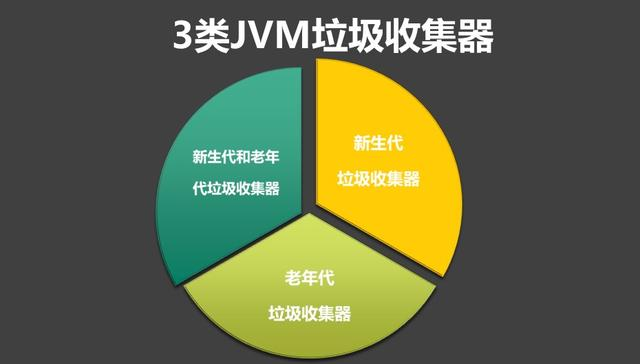
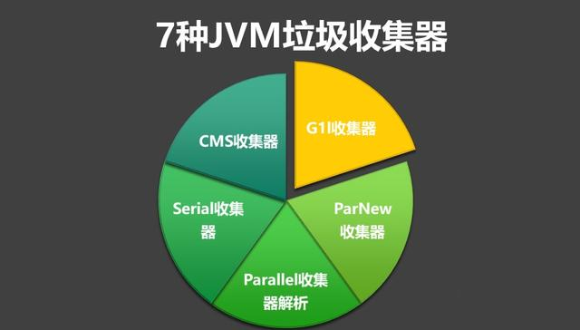
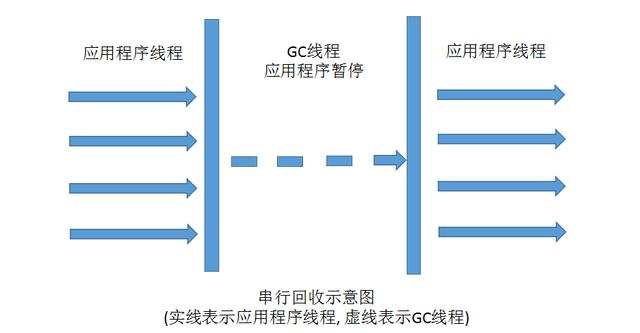
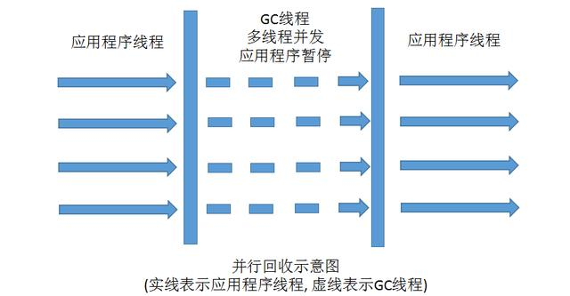
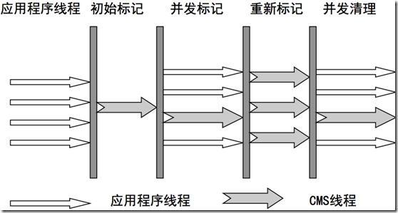
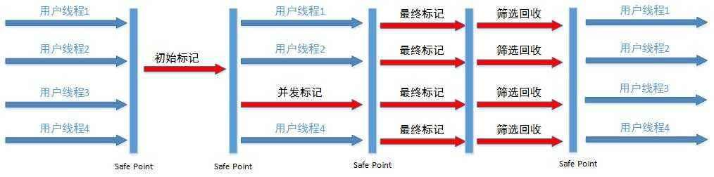

# 直通BAT必考题系列：7种JVM垃圾收集器特点，优劣势、及使用场景

如果说垃圾收集算法是JVM内存回收的方法论，那么垃圾收集器就是内存回收的具体实现。

### 常见的垃圾收集器有3类：

#### 1.新生代的收集器包括：
- Serial
- PraNew
- Parallel Scavenge
#### 2.老年代的收集器包括：
 - Serial Old
 - Parallel Old
 - CMS
#### 3.回收整个Java堆(新生代和老年代)
- G1收集器

今天我们详细谈谈以上7种垃圾收集器的优劣势和使用场景。

### 新生代垃圾收集器
#### 1.Serial串行收集器-复制算法

Serial收集器是新生代单线程收集器，优点是简单高效，算是最基本、发展历史最悠久的收集器。它在进行垃圾收集时，必须暂停其他所有的工作线程，直到它收集完成。

Serial收集器依然是虚拟机运行在Client模式下默认新生代收集器，对于运行在Client模式下的虚拟机来说是一个很好的选择。

#### 2.ParNew收集器-复制算法

ParNew收集器是新生代并行收集器，其实就是Serial收集器的多线程版本。

除了使用多线程进行垃圾收集之外，其余行为包括Serial收集器可用的所有控制参数、收集算法、Stop The Worl、对象分配规则、回收策略等都与Serial 收集器完全一样。

#### 3.Parallel Scavenge（并行回收）收集器-复制算法

Parallel Scavenge收集器是新生代并行收集器，追求高吞吐量，高效利用 CPU。

该收集器的目标是达到一个可控制的吞吐量（Throughput）。所谓吞吐量就是CPU用于运行用户代码的时间与CPU总消耗时间的比值，即 吞吐量=运行用户代码时间/（运行用户代码时间+垃圾收集时间）

停顿时间越短就越适合需要与用户交互的程序，良好的响应速度能提升用户体验，而高吞吐量则可用高效率地利用CPU时间，尽快完成程序的运算任务，主要适合在后台运算而不需要太多交互的任务。

### 老年代垃圾收集器
#### 1.Serial Old 收集器-标记整理算法

Serial Old是Serial收集器的老年代版本，它同样是一个单线程(串行)收集器，使用标记整理算法。这个收集器的主要意义也是在于给Client模式下的虚拟机使用。

如果在Server模式下，主要两大用途：

1. 在JDK1.5以及之前的版本中与Parallel Scavenge收集器搭配使用
2. 作为CMS收集器的后备预案，在并发收集发生Concurrent Mode Failure时使用

#### 2.Parallel Old 收集器-标记整理算法

Parallel Old 是Parallel Scavenge收集器的老年代版本，使用多线程和“标记-整理”算法。这个收集器在1.6中才开始提供。

#### 3.CMS收集器-标记整理算法

CMS(Concurrent Mark Sweep)收集器是一种以获取最短回收停顿时间为目标的收集器。

目前很大一部分的Java应用集中在互联网站或者B/S系统的服务端上，这类应用尤其重视服务器的响应速度，希望系统停顿时间最短，以给用户带来较好的体验。CMS收集器就非常符合这类应用的需求。

CMS收集器是基于“标记-清除”算法实现的，它的运作过程相对前面几种收集器来说更复杂一些，整个过程分为4个步骤：

1. 初始标记
2. 并发标记
3. 重新标记
4. 并发清除

其中，初始标记、重新标记这两个步骤仍然需要“Stop The World”

CMS收集器主要优点：

- 并发收集
- 低停顿

CMS三个明显的缺点：
1. CMS收集器对CPU资源非常敏感。CPU个数少于4个时，CMS对于用户程序的影响就可能变得很大，
        为了应付这种情况，虚拟机提供了一种称为“增量式并发收集器”的CMS收集器变种。
2. CMS收集器无法处理浮动垃圾，可能出现“Concurrent Mode Failure”失败而导致另一次Full GC的产生。
        在JDK1.5的默认设置下，CMS收集器当老年代使用了68%的空间后就会被激活。
3. CMS是基于“标记-清除”算法实现的收集器，收集结束时会有大量空间碎片产生。
        空间碎片过多，可能会出现老年代还有很大空间剩余，但是无法找到足够大的连续空间来分配当前对象，不得不提前出发FullGC。

### 新生代和老年代垃圾收集器
#### 1.G1收集器-标记整理算法

JDK1.7后全新的回收器, 用于取代CMS收集器。

G1收集器的优势：

1. 独特的分代垃圾回收器,分代GC: 分代收集器, 同时兼顾年轻代和老年代
2. 使用分区算法, 不要求eden, 年轻代或老年代的空间都连续
3. 并行性: 回收期间, 可由多个线程同时工作, 有效利用多核cpu资源
4. 空间整理: 回收过程中, 会进行适当对象移动, 减少空间碎片
5. 可预见性: G1可选取部分区域进行回收, 可以缩小回收范围, 减少全局停顿
 
G1收集器的运作大致可划分为一下步骤：

G1收集器的阶段分以下几个步骤：

1. 初始标记（它标记了从GC Root开始直接可达的对象）
2. 并发标记（从GC Roots开始对堆中对象进行可达性分析，找出存活对象）
3. 最终标记（标记那些在并发标记阶段发生变化的对象，将被回收）
4. 筛选回收（首先对各个Regin的回收价值和成本进行排序，根据用户所期待的GC停顿时间指定回收计划，回收一部分Region）

### JVM垃圾收集器总结
本文主要介绍了JVM中的垃圾回收器，主要包括串行回收器、并行回收器以及CMS回收器、G1回收器。他们各自都有优缺点，通常来说你需要根据你的业务，进行基于垃圾回收器的性能测试，然后再做选择。下面给出配置回收器时，经常使用的参数：

-XX:+UseSerialGC：在新生代和老年代使用串行收集器

-XX:+UseParNewGC：在新生代使用并行收集器

-XX:+UseParallelGC ：新生代使用并行回收收集器，更加关注吞吐量

-XX:+UseParallelOldGC：老年代使用并行回收收集器

-XX:ParallelGCThreads：设置用于垃圾回收的线程数

-XX:+UseConcMarkSweepGC：新生代使用并行收集器，老年代使用CMS+串行收集器

-XX:ParallelCMSThreads：设定CMS的线程数量

-XX:+UseG1GC：启用G1垃圾回收器
