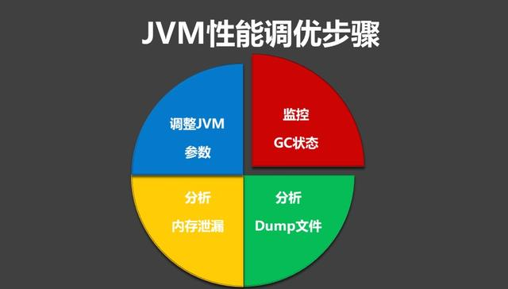
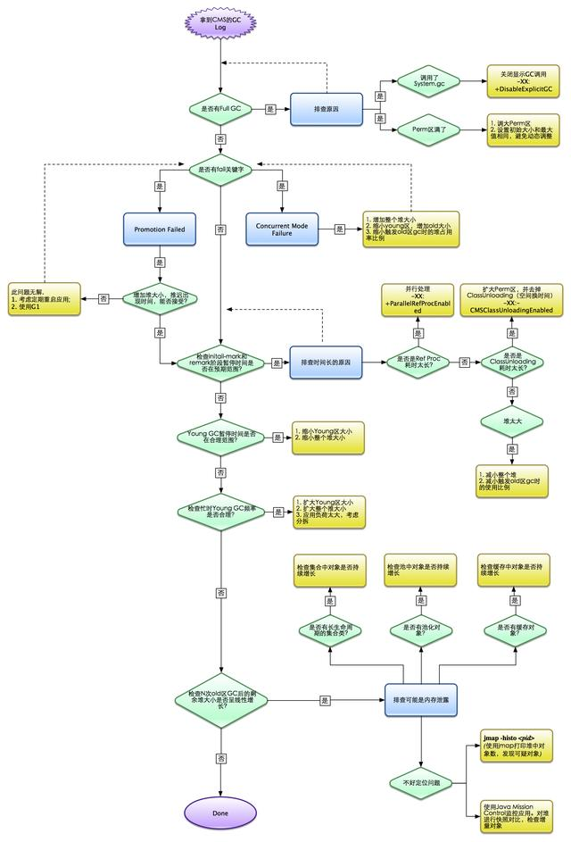

## JVM性能调优的6大步骤，及关键调优参数详解

### 对JVM内存的系统级的调优主要的目的是减少GC的频率和Full GC的次数。

#### 1.Full GC

会对整个堆进行整理，包括Young、Tenured和Perm。Full GC因为需要对整个堆进行回收，所以比较慢，因此应该尽可能减少Full GC的次数。

#### 2.导致Full GC的原因

1. 年老代（Tenured）被写满  
调优时尽量让对象在新生代GC时被回收、让对象在新生代多存活一段时间和不要创建过大的对象及数组避免直接在旧生代创建对象 。

2. 持久代Pemanet Generation空间不足    
增大Perm Gen空间，避免太多静态对象,控制好新生代和旧生代的比例

3. System.gc()被显示调用     
垃圾回收不要手动触发，尽量依靠JVM自身的机制

### 在对JVM调优的过程中，很大一部分工作就是对于FullGC的调节，下面详细介绍对应JVM调优的方法和步骤。

#### JVM性能调优方法和步骤

#### 1.监控GC的状态

使用各种JVM工具，查看当前日志，分析当前JVM参数设置，并且分析当前堆内存快照和gc日志，根据实际的各区域内存划分和GC执行时间，觉得是否进行优化。

举一个例子： 系统崩溃前的一些现象：

- 每次垃圾回收的时间越来越长，由之前的10ms延长到50ms左右，FullGC的时间也有之前的0.5s延长到4、5s
- FullGC的次数越来越多，最频繁时隔不到1分钟就进行一次FullGC
- 年老代的内存越来越大并且每次FullGC后年老代没有内存被释放       

之后系统会无法响应新的请求，逐渐到达OutOfMemoryError的临界值，这个时候就需要分析JVM内存快照dump。

#### 2.生成堆的dump文件

通过JMX的MBean生成当前的Heap信息，大小为一个3G（整个堆的大小）的hprof文件，如果没有启动JMX可以通过Java的jmap命令来生成该文件。

#### 3.分析dump文件

打开这个3G的堆信息文件，显然一般的Window系统没有这么大的内存，必须借助高配置的Linux，几种工具打开该文件：

- Visual VM
- IBM HeapAnalyzer
- JDK 自带的Hprof工具
- Mat(Eclipse专门的静态内存分析工具)推荐使用

备注：文件太大，建议使用Eclipse专门的静态内存分析工具Mat打开分析。

#### 4.分析结果，判断是否需要优化

如果各项参数设置合理，系统没有超时日志出现，GC频率不高，GC耗时不高，那么没有必要进行GC优化，如果GC时间超过1-3秒，或者频繁GC，则必须优化。

注：如果满足下面的指标，则一般不需要进行GC：

+ Minor GC执行时间不到50ms；
+ Minor GC执行不频繁，约10秒一次；
+ Full GC执行时间不到1s；
+ Full GC执行频率不算频繁，不低于10分钟1次；
#### 5.调整GC类型和内存分配

如果内存分配过大或过小，或者采用的GC收集器比较慢，则应该优先调整这些参数，并且先找1台或几台机器进行beta，然后比较优化过的机器和没有优化的机器的性能对比，并有针对性的做出最后选择。

#### 6.不断的分析和调整

通过不断的试验和试错，分析并找到最合适的参数，如果找到了最合适的参数，则将这些参数应用到所有服务器。

cms参数优化步流程

下面我再继续介绍下JVM的关键参数配置(仅用于参考)。

### JVM调优参数参考
1. 针对JVM堆的设置，一般可以通过-Xms -Xmx限定其最小、最大值，为了防止垃圾收集器在最小、最大之间收缩堆而产生额外的时间，通常把最大、最小设置为相同的值;

2. 年轻代和年老代将根据默认的比例（1：2）分配堆内存， 可以通过调整二者之间的比率NewRadio来调整二者之间的大小，也可以针对回收代。     
比如年轻代，通过 -XX:newSize -XX:MaxNewSize来设置其绝对大小。同样，为了防止年轻代的堆收缩，我们通常会把-XX:newSize -XX:MaxNewSize设置为同样大小。

3. 年轻代和年老代设置多大才算合理
    1. 更大的年轻代必然导致更小的年老代，大的年轻代会延长普通GC的周期，但会增加每次GC的时间；小的年老代会导致更频繁的Full GC

    2. 更小的年轻代必然导致更大年老代，小的年轻代会导致普通GC很频繁，但每次的GC时间会更短；大的年老代会减少Full GC的频率

如何选择应该依赖应用程序对象生命周期的分布情况： 如果应用存在大量的临时对象，应该选择更大的年轻代；如果存在相对较多的持久对象，年老代应该适当增大。但很多应用都没有这样明显的特性。

在抉择时应该根 据以下两点：

（1）本着Full GC尽量少的原则，让年老代尽量缓存常用对象，JVM的默认比例1：2也是这个道理 。

（2）通过观察应用一段时间，看其他在峰值时年老代会占多少内存，在不影响Full GC的前提下，根据实际情况加大年轻代，比如可以把比例控制在1：1。但应该给年老代至少预留1/3的增长空间。

4. 在配置较好的机器上（比如多核、大内存），可以为年老代选择并行收集算法： -XX:+UseParallelOldGC 。

5. 线程堆栈的设置：每个线程默认会开启1M的堆栈，用于存放栈帧、调用参数、局部变量等，对大多数应用而言这个默认值太大了，一般256K就足用。

理论上，在内存不变的情况下，减少每个线程的堆栈，可以产生更多的线程，但这实际上还受限于操作系统。