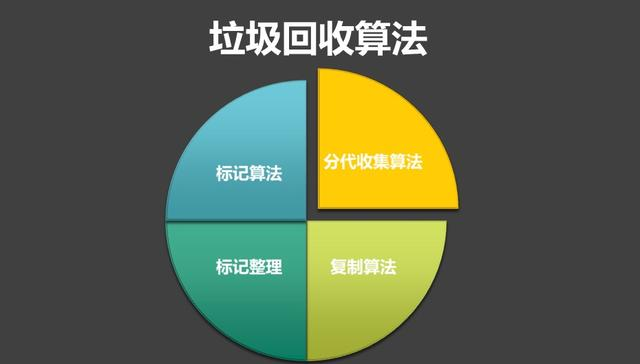
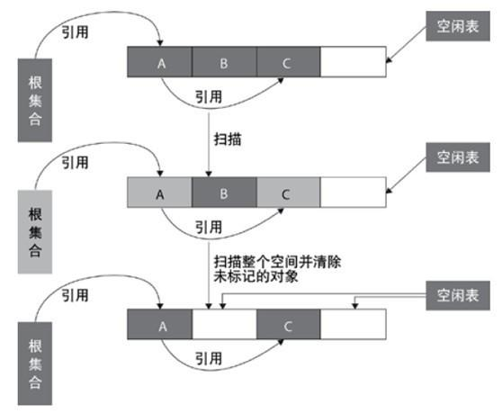
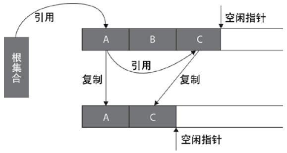
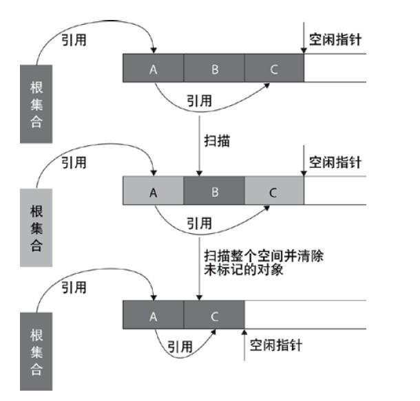
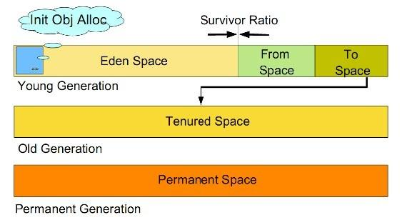
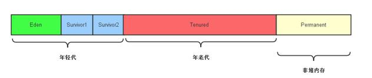

# 直通BAT必考题系列：深入详解JVM内存模型与JVM参数详细配置 

## 垃圾回收算法
### 1.标记清除

标记-清除算法将垃圾回收分为两个阶段：标记阶段和清除阶段。

在标记阶段首先通过根节点(GC Roots)，标记所有从根节点开始的对象，未被标记的对象就是未被引用的垃圾对象。
然后，在清除阶段，清除所有未被标记的对象。

适用场合：
- 存活对象较多的情况下比较高效
- 适用于年老代（即旧生代）

缺点：
- 容易产生内存碎片，再来一个比较大的对象时（典型情况：该对象的大小大于空闲表中的每一块儿大小但是小于其中两块儿的和），会提前触发垃圾回收
- 扫描了整个空间两次（第一次：标记存活对象；第二次：清除没有标记的对象）

### 2.复制算法

从根集合节点进行扫描，标记出所有的存活对象，并将这些存活的对象复制到一块儿新的内存（图中下边的那一块儿内存）上去，之后将原来的那一块儿内存（图中上边的那一块儿内存）全部回收掉

现在的商业虚拟机都采用这种收集算法来回收新生代。

适用场合：
 - 存活对象较少的情况下比较高效
 - 扫描了整个空间一次（标记存活对象并复制移动）
 - 适用于年轻代（即新生代）：基本上98%的对象是”朝生夕死”的，存活下来的会很少

缺点：
 - 需要一块儿空的内存空间
 - 需要复制移动对象

### 3.标记整理

复制算法的高效性是建立在存活对象少、垃圾对象多的前提下的。

这种情况在新生代经常发生，但是在老年代更常见的情况是大部分对象都是存活对象。如果依然使用复制算法，由于存活的对象较多，复制的成本也将很高。

标记-压缩算法是一种老年代的回收算法，它在标记-清除算法的基础上做了一些优化。

首先也需要从根节点开始对所有可达对象做一次标记，但之后，它并不简单地清理未标记的对象，而是将所有的存活对象压缩到内存的一端。之后，清理边界外所有的空间。这种方法既避免了碎片的产生，又不需要两块相同的内存空间，因此，其性价比比较高。

### 4.分代收集算法

分代收集算法就是目前虚拟机使用的回收算法，它解决了标记整理不适用于老年代的问题，将内存分为各个年代。一般情况下将堆区划分为老年代（Tenured Generation）和新生代（Young Generation），在堆区之外还有一个代就是永久代（Permanet Generation）。

在不同年代使用不同的算法，从而使用最合适的算法，新生代存活率低，可以使用复制算法。而老年代对象存活率搞，没有额外空间对它进行分配担保，所以只能使用标记清除或者标记整理算法。

## 垃圾回收机制
年轻代分为Eden区和survivor区（两块儿：from和to），且Eden:from:to==8:1:1。

### jvm内存结构

1）新产生的对象优先分配在Eden区（除非配置了-XX:PretenureSizeThreshold，大于该值的对象会直接进入年老代）；

2）当Eden区满了或放不下了，这时候其中存活的对象会复制到from区。

这里，需要注意的是，如果存活下来的对象from区都放不下，则这些存活下来的对象全部进入年老代。之后Eden区的内存全部回收掉。

3）之后产生的对象继续分配在Eden区，当Eden区又满了或放不下了，这时候将会把Eden区和from区存活下来的对象复制到to区（同理，如果存活下来的对象to区都放不下，则这些存活下来的对象全部进入年老代），之后回收掉Eden区和from区的所有内存。

4）如上这样，会有很多对象会被复制很多次（每复制一次，对象的年龄就+1），默认情况下，当对象被复制了15次（这个次数可以通过：-XX:MaxTenuringThreshold来配置），就会进入年老代了。

5）当年老代满了或者存放不下将要进入年老代的存活对象的时候，就会发生一次Full GC（这个是我们最需要减少的，因为耗时很严重）。

### 垃圾回收有两种类型：Minor GC 和 Full GC。
1.Minor GC

对新生代进行回收，不会影响到年老代。因为新生代的 Java 对象大多死亡频繁，所以 Minor GC 非常频繁，一般在这里使用速度快、效率高的算法，使垃圾回收能尽快完成。

2.Full GC

也叫Major GC，对整个堆进行回收，包括新生代和老年代。由于Full GC需要对整个堆进行回收，所以比Minor
GC要慢，因此应该尽可能减少Full GC的次数，导致Full
GC的原因包括：老年代被写满、永久代（Perm）被写满和System.gc()被显式调用等。

## 垃圾回收算法总结
1. 年轻代：复制算法
    1. 所有新生成的对象首先都是放在年轻代的。年轻代的目标就是尽可能快速的收集掉那些生命周期短的对象。
    2. 新生代内存按照8:1:1的比例分为一个eden区和两个survivor(survivor0,survivor1)区。
    一个Eden区，两个Survivor区(一般而言)。大部分对象在Eden区中生成。
    回收时先将eden区存活对象复制到一个survivor0区，然后清空eden区，当这个survivor0区也存放满了时，
    则将eden区和survivor0区存活对象复制到另一个survivor1区，然后清空eden和这个survivor0区，
    此时survivor0区是空的，然后将survivor0区和survivor1区交换，即保持survivor1区为空，如此往复。
    3. 当survivor1区不足以存放 eden和survivor0的存活对象时，就将存活对象直接存放到老年代。若是老年代也满了就会触发一次Full GC(Major GC)，也就是新生代、老年代都进行回收。
    4. 新生代发生的GC也叫做Minor GC，MinorGC发生频率比较高(不一定等Eden区满了才触发)。

2. 年老代：标记-清除或标记-整理
    1. 在年轻代中经历了N次垃圾回收后仍然存活的对象，就会被放到年老代中。因此，可以认为年老代中存放的都是一些生命周期较长的对象。
    2. 内存比新生代也大很多(大概比例是1:2)，当老年代内存满时触发Major GC即Full GC，Full GC发生频率比较低，老年代对象存活时间比较长，存活率标记高。
        以上这种年轻代与年老代分别采用不同回收算法的方式称为”分代收集算法”，这也是当下企业使用的一种方式

3. 每一种算法都会有很多不同的垃圾回收器去实现，在实际使用中，根据自己的业务特点做出选择就好。