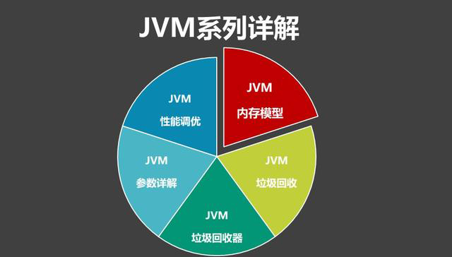
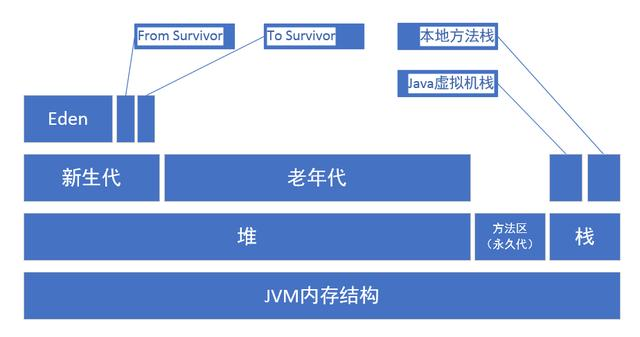
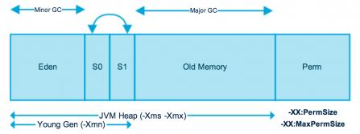

# 直通BAT必考题系列：深入详解JVM内存模型与JVM参数详细配置

JVM基本是BAT面试必考的内容，今天我们先从JVM内存模型开启详解整个JVM系列，
希望看完整个系列后，可以轻松通过BAT关于JVM的考核。



### BAT必考JVM系列专题
1. JVM内存模型
2. JVM垃圾回收算法
3. JVM垃圾回收器
4. JVM参数详解
5. JVM性能调优

### JVM内存结构



由上图可以清楚的看到JVM的内存空间分为3大部分：
````
 堆内存
 方法区
 栈内存
````
其中栈内存可以再细分为java虚拟机栈和本地方法栈
堆内存可以划分为新生代和老年代
新生代中还可以再次划分为Eden区、From Survivor区和To Survivor区。

其中一部分是线程共享的，包括 Java 堆和方法区；
另一部分是线程私有的，包括虚拟机栈和本地方法栈，以及程序计数器这一小部分内存。


### 堆内存（Heap

java 堆（Java Heap）是Java 虚拟机所管理的内存中最大的一块。

堆是被所有线程共享的区域，实在虚拟机启动时创建的。

堆里面存放的都是对象的实例（new 出来的对象都存在堆中）。

此内存区域的唯一目的就是存放对象实例（new的对象），几乎所有的对象实例都在这里分配内存。

堆内存分为两个部分：年轻代和老年代。

我们平常所说的垃圾回收，主要回收的就是堆区。

更细一点划分新生代又可划分为Eden区和2个Survivor区（From Survivor和To Survivor）。

下图中的Perm代表的是永久代，但是注意永久代并不属于堆内存中的一部分，**同时jdk1.8之后永久代已经被移除。**



新生代 ( Young ) 与老年代 ( Old ) 的比例的值为 1:2 ( 该值可以通过参数 –XX:NewRatio 来指定 )

默认的，Eden : from : to = 8 : 1 : 1 ( 可以通过参数 –XX:SurvivorRatio 来设定 )，
即： Eden = 8/10 的新生代空间大小，from = to = 1/10 的新生代空间大小。

### 方法区（Method Area）

方法区也称"永久代"，它用于存储虚拟机加载的类信息、常量、静态变量、是各个线程共享的内存区域。

在JDK8之前的HotSpot JVM，存放这些”永久的”的区域叫做“永久代(permanent generation)”。

永久代是一片连续的堆空间，在JVM启动之前通过在命令行设置参数-XX:MaxPermSize来设定永久代最大可分配的内存空间，默认大小是64M（64位JVM默认是85M）。

随着JDK8的到来，JVM不再有 永久代(PermGen)。但类的元数据信息（metadata）还在，只不过不再是存储在连续的堆空间上，而是移动到叫做'Metaspace'的本地内存(Native memory)。

方法区或永生代相关设置
````
 -XX:PermSize=64MB 最小尺寸，初始分配
 -XX:MaxPermSize=256MB 最大允许分配尺寸，按需分配
 -XX:+CMSClassUnloadingEnabled -XX:+CMSPermGenSweepingEnabled 设置垃圾不回收
 默认大小
 -server选项下默认MaxPermSize为64m
 -client选项下默认MaxPermSize为32m
````
 
### 虚拟机栈(JVM Stack)
java虚拟机栈是线程私有，生命周期与线程相同。创建线程的时候就会创建一个java虚拟机栈。

虚拟机执行java程序的时候，每个方法都会创建一个栈帧，栈帧存放在java虚拟机栈中，通过压栈出栈的方式进行方法调用。

栈帧又分为一下几个区域：局部变量表、操作数栈、动态连接、方法出口等。
平时我们所说的变量存在栈中，这句话说的不太严谨，应该说局部变量存放在java虚拟机栈的局部变量表中。
java的8中基本类型的局部变量的值存放在虚拟机栈的局部变量表中，如果是引用型的变量，则只存储对象的引用地址。


### 本地方法栈(Native Stack)
本地方法栈（Native Method Stacks）与虚拟机栈所发挥的作用是非常相似的，
其区别不过是虚拟机栈为虚拟机执行Java方法（也就是字节码）服务，
而本地方法栈则是为虚拟机使用到的Native方法服务。

### 程序计数器（PC Register）
程序计数器就是记录当前线程执行程序的位置，改变计数器的值来确定执行的下一条指令，比如循环、分支、方法跳转、异常处理，线程恢复都是依赖程序计数器来完成。
Java虚拟机多线程是通过线程轮流切换并分配处理器执行时间的方式实现的。为了线程切换能恢复到正确的位置，每条线程都需要一个独立的程序计数器，所以它是线程私有的。

### 直接内存
直接内存并不是虚拟机内存的一部分，也不是Java虚拟机规范中定义的内存区域。jdk1.4中新加入的NIO，引入了通道与缓冲区的IO方式，它可以调用Native方法直接分配堆外内存，这个堆外内存就是本机内存，不会影响到堆内存的大小。

### JVM内存参数设置
````
 -Xms设置堆的最小空间大小。
 -Xmx设置堆的最大空间大小。
 -Xmn:设置年轻代大小
 -XX:NewSize设置新生代最小空间大小。
 -XX:MaxNewSize设置新生代最大空间大小。
 -XX:PermSize设置永久代最小空间大小。
 -XX:MaxPermSize设置永久代最大空间大小。
 -Xss设置每个线程的堆栈大小
 -XX:+UseParallelGC:选择垃圾收集器为并行收集器。
    此配置仅对年轻代有效。即上述配置下,年轻代使用并发收集,而年老代仍旧使用串行收集。
 -XX:ParallelGCThreads=20:配置并行收集器的线程数
    即:同时多少个线程一起进行垃圾回收。此值最好配置与处理器数目相等。
典型JVM参数配置参考:
 java-Xmx3550m-Xms3550m-Xmn2g-Xss128k
 -XX:ParallelGCThreads=20
 -XX:+UseConcMarkSweepGC-XX:+UseParNewGC
-Xmx3550m:设置JVM最大可用内存为3550M。

-Xms3550m:设置JVM促使内存为3550m。此值可以设置与-Xmx相同,以避免每次垃圾回收完成后JVM重新分配内存。

-Xmn2g:设置年轻代大小为2G。整个堆大小=年轻代大小+年老代大小+持久代大小。
    持久代一般固定大小为64m,所以增大年轻代后,将会减小年老代大小。此值对系统性能影响较大,官方推荐配置为整个堆的3/8。

-Xss128k:设置每个线程的堆栈大小。
    JDK5.0以后每个线程堆栈大小为1M,以前每个线程堆栈大小为256K。
    更具应用的线程所需内存大小进行调整。在相同物理内存下,减小这个值能生成更多的线程。
    但是操作系统对一个进程内的线程数还是有限制的,不能无限生成,经验值在3000~5000左右。
````