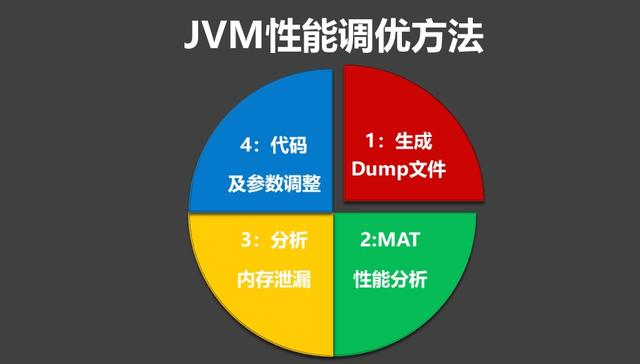

## 高并发编程系列：4大JVM性能分析工具详解，及内存泄漏分析方案

### 什么场景需要JVM调优
- OutOfMemoryError，内存不足
- 内存泄露
- 线程死锁
- 锁争用（Lock Contention）
- Java进程消耗CPU过高         

这些问题出现的时候常常通过重启服务器或者调大内存来临时解决，实际情况，还需要尽量还原当时的业务场景，并分析内存、线程等数据，通过分析找到最终的解决方案，这就会涉及到性能分析工具。

### JVM性能监控分析工具
JDK本身提供了很丰富的性能监控工具，除了集成式的visualVM和jConsole外，还有jstat,jstack,jps,jmap,jhat小工具，这些都是性能调优的常用工具。

- Jconsole : jdk自带，功能简单，但是可以在系统有一定负荷的情况下使用。对垃圾回收算法有很详细的跟踪。
- JProfiler：商业软件，功能强大。
- VisualVM：JDK自带，功能强大，与JProfiler类似。
- MAT：MAT(Memory Analyzer Tool)，一个基于Eclipse的内存分析工具。

下面介绍这些JVM工具的使用。

JVM性能调优工具

### VisualVM
VisualVM 是javajdk自带的牛逼的调优工具，也是平时使用最多调优工具，几乎涉及了jvm调优的方方面面。启动起来后和jconsole 一样同样可以选择本地和远程，如果需要监控远程同样需要配置相关参数。

#### 1.打开VisualVM

这个工具放在JDK安装目录的bin目录下，双击jvisualvm.exe即可打开，如下图所示

#### 2. 监视页面主要展示 系统资源占用情况

- CPU :展示java程序运行的时候占用的cpu资源
- 堆 :这里要说明下堆内存的组成部分,堆是由老年代和新生代组成，其中新生代有由”伊甸园”和”两个幸存区组成”三部分组成，堆视图看到的资源占用实际是”老年代”、”伊甸园（Eden）”、”两个幸存者（Survivor ）”的一个综合情况。
- PermGen :Perm 区用来存放java类以及其他虚拟机自己的静态数据，（常被称为持久代或者方法区）
- 类 :此视图 主要展示 当前程序加载了多少个类
- 线程: 当前程序的线程启动情况
- 堆Dump : 生产当前程序的内存快照hprof文件，对于分析内存溢出问题比较有帮助。

#### 3. 线程页面(主要展示程序中所有的线程运行状态)

- 线程dump ： 所有线程的快照（对分析线程死锁，比较有帮助）
- 时间线 ： 展示每个线程的实时运行状态（不同颜色代表不同的状态）

VisualVM可以根据需要安装不同的插件，每个插件的关注点都不同，有的主要监控GC，有的主要监控内存，有的监控线程等。

### Jconsole
JConsole是一个JMX（Java Management Extensions，即Java管理扩展）的JVM监控与管理工具，监控主要体现在：堆栈内存、线程、CPU、类、VM信息这几个方面，而管理主要是对JMX
MBean（managedbeans，被管理的beans，是一系列资源，包含对象、接口、设备等）的管理，不仅能查看bean的属性和方法信息，还能够在运行时修改属性或调用方法。

#### 1.打开Jconsole

直接在jdk/bin目录下点击jconsole.exe即可启动，界面如下:

1、内存

在内存页我们可以看到程序运行期间JVM各个部分的内存状况，右下角是对应各个分区的内存使用柱状图，点击对应柱可查看详情，看图：

2、线程

该页面可以查看当前JVM进程启动了多少个线程，并能查看每个线程的状态及堆栈信息，此外还有一个功能就是能够自动检测死锁，见图：

3、类

该页面其实和线程页有些相似，不过显示的是JVM加载类的信息，见图：

4、VM概述

这个其实没必要细说，看图就明白，显示了当前JVM的各方面信息：

5、MBean管理

### MAT
MAT(Memory Analyzer Tool)，一个基于Eclipse的内存分析工具，是一个快速、功能丰富的Java heap分析工具，它可以帮助我们查找内存泄漏和减少内存消耗。

可以利用visualvm或者是 jmap命令生产堆文件在进行内存分析。

1.用jmap生成堆信息

     
这样在E盘的jmap文件夹里会有一个map.bin的堆信息文件

2.将堆信息导入到mat中分析

3.生成分析报告

可以利用visualvm或者是 jmap命令生产堆文件，导入eclipse mat中生成分析报告：

1)Histogram（直方图）视图

- Class Name ： 类名称，java类名
- Objects ： 类的对象的数量，这个对象被创建了多少个
- Shallow Heap ：一个对象内存的消耗大小，不包含对其他对象的引用
- Retained Heap ：是shallow Heap的总和，也就是该对象被GC之后所能回收到内存的总和 

通过直方图视图可以很容易找到占用内存最多的几个类（通过Retained Heap排序），还可以通过其他方式进行分组（见下图）。

如果存在内存溢出，时间久了溢出类的实例数量或者内存占比会越来越多，排名也越来越靠前。

图标进行对比，通过多次对比不同时间点下的直方图对比就很容易把溢出的类找出来。

2)支配树（Dominator Tree）

MAT提供了一个称为支配树（Dominator Tree）的对象图。支配树体现了对象实例间的支配关系，在此视图中列出了每个对象（Object Instance）与其引用关系的树状结构，同时包含了占用内存的大小和百分比。

通过Dominator Tree视图可以很容易的找出占用内存最多的几个对象（根据Retained Heap或Percentage排序），和Histogram类似，可以通过不同的方式进行分组显示：

Histogram视图和Dominator Tree视图的角度不同，前者是基于类的角度，后者是基于对象实例的角度，并且可以更方便的看出其引用关系。

以上只是一个初步的介绍，mat还有更强大的使用，比如对比堆内存，在生产环境中往往为了定位问题，每隔几分钟dump出一下内存快照，随后在对比不同时间的堆内存的变化来发现问题。

### JVM内存泄漏分析

造成OutOfMemoryError内存泄露典型原因：对象已经死了，无法通过垃圾收集器进行自动回收，需要通过找出泄露的代码位置和原因，才好确定解决方案。

分析步骤：

1. 用工具生成java应用程序的heap dump（如jmap）

2. 使用Java heap分析工具（如MAT），找出内存占用超出预期的嫌疑对象

3. 根据情况，分析嫌疑对象和其他对象的引用关系。

4. 分析程序的源代码，找出嫌疑对象数量过多的原因。