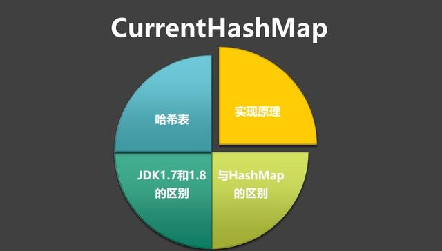
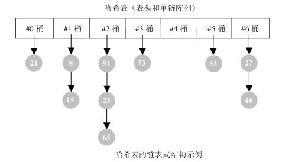
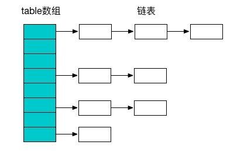
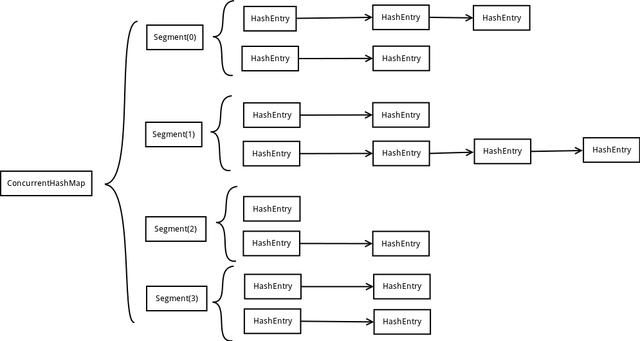
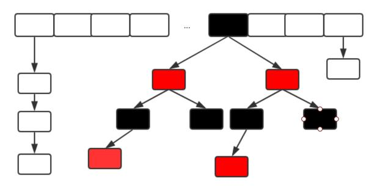

HashMap、CurrentHashMap 的实现原理基本都是BAT面试必考内容，阿里P8架构师谈：深入探讨HashMap的底层结构、原理、扩容机制深入谈过hashmap的实现原理以及在JDK 1.8的实现区别，今天主要谈CurrentHashMap的实现原理，以及在JDK1.7和1.8的区别。

内容目录：

1. 哈希表

2. ConcurrentHashMap与HashMap、HashTable的区别

3. CurrentHashMap在JDK1.7和JDK1.8版本的区别




### 哈希表
#### 1.介绍

哈希表就是一种以 键-值(key-indexed) 存储数据的结构，我们只要输入待查找的值即key，即可查找到其对应的值。

哈希的思路很简单，如果所有的键都是整数，那么就可以使用一个简单的无序数组来实现：将键作为索引，值即为其对应的值，这样就可以快速访问任意键的值。这是对于简单的键的情况，我们将其扩展到可以处理更加复杂的类型的键。

#### 2.链式哈希表

链式哈希表从根本上说是由一组链表构成。每个链表都可以看做是一个“桶”，我们将所有的元素通过散列的方式放到具体的不同的桶中。插入元素时，首先将其键传入一个哈希函数（该过程称为哈希键），函数通过散列的方式告知元素属于哪个“桶”，然后在相应的链表头插入元素。查找或删除元素时，用同们的方式先找到元素的“桶”，然后遍历相应的链表，直到发现我们想要的元素。因为每个“桶”都是一个链表，所以链式哈希表并不限制包含元素的个数。然而，如果表变得太大，它的性能将会降低。



#### 3.应用场景

我们熟知的缓存技术（比如redis、memcached）的核心其实就是在内存中维护一张巨大的哈希表，还有大家熟知的HashMap、CurrentHashMap等的应用。

### ConcurrentHashMap与HashMap等的区别
#### 1.HashMap

我们知道HashMap是线程不安全的，在多线程环境下，使用Hashmap进行put操作会引起死循环，导致CPU利用率接近100%，所以在并发情况下不能使用HashMap。

#### 2.HashTable

HashTable和HashMap的实现原理几乎一样，差别无非是

- HashTable不允许key和value为null
- HashTable是线程安全的

但是HashTable线程安全的策略实现代价却太大了，简单粗暴，get/put所有相关操作都是synchronized的，这相当于给整个哈希表加了一把大锁。

多线程访问时候，只要有一个线程访问或操作该对象，那其他线程只能阻塞，相当于将所有的操作串行化，在竞争激烈的并发场景中性能就会非常差。

#### 3.ConcurrentHashMap

主要就是为了应对hashmap在并发环境下不安全而诞生的，ConcurrentHashMap的设计与实现非常精巧，大量的利用了volatile，final，CAS等lock-free技术来减少锁竞争对于性能的影响。

我们都知道Map一般都是数组+链表结构（JDK1.8该为数组+红黑树）。



ConcurrentHashMap避免了对全局加锁改成了局部加锁操作，这样就极大地提高了并发环境下的操作速度，由于ConcurrentHashMap在JDK1.7和1.8中的实现非常不同，接下来我们谈谈JDK在1.7和1.8中的区别。

### JDK1.7版本的CurrentHashMap的实现原理
在JDK1.7中ConcurrentHashMap采用了数组+Segment+分段锁的方式实现。

#### 1.Segment(分段锁)

ConcurrentHashMap中的分段锁称为Segment，它即类似于HashMap的结构，即内部拥有一个Entry数组，数组中的每个元素又是一个链表,同时又是一个ReentrantLock（Segment继承了ReentrantLock）。

#### 2.内部结构

ConcurrentHashMap使用分段锁技术，将数据分成一段一段的存储，然后给每一段数据配一把锁，当一个线程占用锁访问其中一个段数据的时候，其他段的数据也能被其他线程访问，能够实现真正的并发访问。如下图是ConcurrentHashMap的内部结构图：



从上面的结构我们可以了解到，ConcurrentHashMap定位一个元素的过程需要进行两次Hash操作。

第一次Hash定位到Segment，第二次Hash定位到元素所在的链表的头部。

#### 3.该结构的优劣势

坏处

这一种结构的带来的副作用是Hash的过程要比普通的HashMap要长

好处

写操作的时候可以只对元素所在的Segment进行加锁即可，不会影响到其他的Segment，这样，在最理想的情况下，ConcurrentHashMap可以最高同时支持Segment数量大小的写操作（刚好这些写操作都非常平均地分布在所有的Segment上）。

所以，通过这一种结构，ConcurrentHashMap的并发能力可以大大的提高。

### JDK1.8版本的CurrentHashMap的实现原理

JDK8中ConcurrentHashMap参考了JDK8 HashMap的实现，采用了数组+链表+红黑树的实现方式来设计，内部大量采用CAS操作，这里我简要介绍下CAS。

CAS是compare and swap的缩写，即我们所说的比较交换。cas是一种基于锁的操作，而且是乐观锁。在java中锁分为乐观锁和悲观锁。悲观锁是将资源锁住，等一个之前获得锁的线程释放锁之后，下一个线程才可以访问。而乐观锁采取了一种宽泛的态度，通过某种方式不加锁来处理资源，比如通过给记录加version来获取数据，性能较悲观锁有很大的提高。

CAS 操作包含三个操作数 —— 内存位置（V）、预期原值（A）和新值(B)。如果内存地址里面的值和A的值是一样的，那么就将内存里面的值更新成B。CAS是通过无限循环来获取数据的，若果在第一轮循环中，a线程获取地址里面的值被b线程修改了，那么a线程需要自旋，到下次循环才有可能机会执行。

JDK8中彻底放弃了Segment转而采用的是Node，其设计思想也不再是JDK1.7中的分段锁思想。

Node：保存key，value及key的hash值的数据结构。其中value和next都用volatile修饰，保证并发的可见性。

````
class Node<K,V> implements Map.Entry<K,V> {
    final int hash;
    final K key;
    volatile V val;
    volatile Node<K,V> next;
    //... 省略部分代码
}
````

Java8 ConcurrentHashMap结构基本上和Java8的HashMap一样，不过保证线程安全性。

在JDK8中ConcurrentHashMap的结构，由于引入了红黑树，使得ConcurrentHashMap的实现非常复杂，我们都知道，红黑树是一种性能非常好的二叉查找树，其查找性能为O（logN），但是其实现过程也非常复杂，而且可读性也非常差，Doug
Lea的思维能力确实不是一般人能比的，早期完全采用链表结构时Map的查找时间复杂度为O（N），JDK8中ConcurrentHashMap在链表的长度大于某个阈值的时候会将链表转换成红黑树进一步提高其查找性能。



### 总结
其实可以看出JDK1.8版本的ConcurrentHashMap的数据结构已经接近HashMap，相对而言，ConcurrentHashMap只是增加了同步的操作来控制并发，从JDK1.7版本的ReentrantLock+Segment+HashEntry，到JDK1.8版本中synchronized+CAS+HashEntry+红黑树。

1. 数据结构：取消了Segment分段锁的数据结构，取而代之的是数组+链表+红黑树的结构。
2. 保证线程安全机制：JDK1.7采用segment的分段锁机制实现线程安全，其中segment继承自ReentrantLock。JDK1.8采用CAS+Synchronized保证线程安全。
3. 锁的粒度：原来是对需要进行数据操作的Segment加锁，现调整为对每个数组元素加锁（Node）。
4. 链表转化为红黑树:定位结点的hash算法简化会带来弊端,Hash冲突加剧,因此在链表节点数量大于8时，会将链表转化为红黑树进行存储。
5. 查询时间复杂度：从原来的遍历链表O(n)，变成遍历红黑树O(logN)。