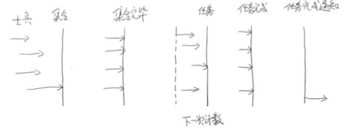

**通常我们所说的并发包也就是java.util.concurrent，Java并发编程集中在这个并发包种，主要包含：Java并发工具类和并发容器等。**

今天主要介绍concurrent包的内容以及4大并发工具类。

### 并发工具包

#### 1.并发工具类

提供了比synchronized更加高级的各种同步结构：包括CountDownLatch、CyclicBarrier、Semaphore等，可以实现更加丰富的多线程操作。

#### 2.并发容器

提供各种线程安全的容器：最常见的ConcurrentHashMap、有序的ConcurrentSkipListMap,实现线程安全的动态数组CopyOnWriteArrayList等。

#### 3.并发队列

各种BlockingQueue的实现：常用的ArrayBlockingQueue、SynchorousQueue或针对特定场景的PriorityBlockingQueue。

#### 4.Executor框架

可以创建各种不同类型的线程池，调度任务运行等，绝大部分情况下，不再需要自己从头实现线程池和任务调度器。

### 常用的并发容器

#### 1.ConcurrentHashMap

经常使用的并发容器，JDK 1.7和1.8的底层数据结构发生了变化(后续文章会详解)，这里可以建议学习顺序如下：从Java7 HashMap -> Java7 ConcurrentHashMap -> Java8 HashMap -> Java8 ConcurrentHashMap，这样可以更好的掌握这个并发容器，毕竟都是从HashMap进化而来。

#### 2.ConcurrentSkipListMap

在乎顺序，需要对数据进行非常频繁的修改

#### 3.CopyOnWrite容器

CopyOnWrite容器即写时复制的容器。从JDK1.5开始Java并发包里提供了两个使用CopyOnWrite机制实现的并发容器,CopyOnWriteArrayList和CopyOnWriteArraySet。

#### 4.各种并发队列的实现

如各种BlockedQueue实现，比较典型的ArrayBlockingQueue、SynchorousQueue。


### 常用的并发工具类

#### 1.CountDownLatch

功能

CountDownLatch是一个同步的辅助类，允许一个或多个线程，等待其他一组线程完成操作，再继续执行。

原理：

- CountDownLatch是通过一个计数器来实现的，计数器的初始值为需要等待线程的数量。     
    eg：CountDownLatch c = new CountDownLatch(10); // 等待线程的数量为10

- 主线程调用CountDownLatch的await()方法会阻塞当前线程(即:主线程在闭锁上等待)，直到计数器的值为0。
- 当一个工作线程完成了自己的任务后，调用CountDownLatch的countDown()方法，计数器的值就会减1。
- 当计数器值为0时，说明所有的工作线程都执行完了，此时，在闭锁上等待的主线程就可以恢复执行任务。

应用场景

倒数计时器

例如：一种典型的场景就是火箭发射。在火箭发射前，为了保证万无一失，往往还要进行各项设备、仪器的检查。 只有等所有检查完毕后，引擎才能点火。这种场景就非常适合使用CountDownLatch。

它可以使得点火线程，等待所有检查线程全部完工后，再执行

使用方式
````
static final CountDownLatch end = new CountDownLatch(10);
end.countDown(); 
end.await();
````
示意图：


#### 2.CyclicBarrier

功能:

CyclicBarrier的字面意思是可循环使用（Cyclic）的屏障（Barrier）。它要做的事情是，让一组线程到达一个屏障（也可以叫同步点）时被阻塞，直到最后一个线程到达屏障时，屏障才会开门，所有被屏障拦截的线程才会继续运行。

和CountDownLatch相似，也是等待某些线程都做完以后再执行。

与CountDownLatch区别

在于这个计数器可以反复使用。比如，假设我们将计数器设置为10。那么凑齐第一批1 0个线程后，计数器就会归零，然后接着凑齐下一批10个线程。

原理：

1) CyclicBarrier是通过一个计数器来实现的，计数器的初始值为需要等待线程的数量。eg：CyclicBarrier c = new CyclicBarrier(2); // 等待线程的数量为2

2) 每个线程调用CyclicBarrier的await()方法，使自己进入等待状态。

3) 当所有的线程都调用了CyclicBarrier的await()方法后，所有的线程停止等待，继续运行。

使用方式：
````
public CyclicBarrier(int parties, Runnable barrierAction) 
barrierAction就是当计数器一次计数完成后，系统会执行的动作
await()
````
示意图：



#### 3.信号量Semaphore

功能：Java提供了经典信号量Semaphore的实现，它通过控制一定数量的许可（permit）的方式，来达到限制通用资源访问的目的。例如：控制并发的线程数。

原理：

1) Semaphore是通过一个计数器(记录许可证的数量)来实现的，计数器的初始值为需要等待线程的数量。   
eg：Semaphore s = new Semaphore(10); // 线程最大的并发数为10

2) 线程通过acquire()方法获取许可证(计数器的值减1)，只有获取到许可证才可以继续执行下去，否则阻塞当前线程。

3) 线程通过release()方法归还许可证(计数器的值加1)。

说明：使用tryAcquire()方法可以立即得到执行的结果：尝试获取一个许可证，若获取成功，则立即返回true，若获取失败，则立即返回false。

应用场景：

Semaphore可以用于做流量控制，特别是公用资源有限的应用场景，比如数据库连接。

举一个场景：例如在车站、机场等出租车时，当很多空出租车就位时，为防止过度拥挤，调度员指挥排队等待坐车的队伍一次进来5个人上车，等这5个人坐车出发，再放进去下一批。这和Semaphore的工作原理有些类似。

#### 4.交换者Exchanger

功能：Exchanger（交换者）是一个用于线程间协作的工具类。Exchanger用于进行线程间的数据交换。它提供一个同步点，在这个同步点两个线程可以交换彼此的数据。这两个线程通过exchange方法交换数据，
如果第一个线程先执行exchange方法，它会一直等待第二个线程也执行exchange，当两个线程都到达同步点时，这两个线程就可以交换数据，将本线程生产出来的数据传递给对方。

原理：

1) 线程A调用public V exchange(V dataA)方法，线程A到达同步点，并且在线程B到达同步点前一直等待。

2) 线程B调用public V exchange(V dataB)方法，线程B到达同步点。

3) 线程A与线程B都达到同步点时，线程将自己的数据传递给对方，两个线程完成了数据的交换了。

Exchanger的应用场景

Exchanger可以用于校对工作的场景。