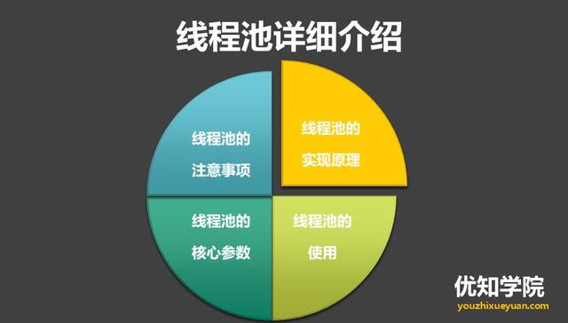
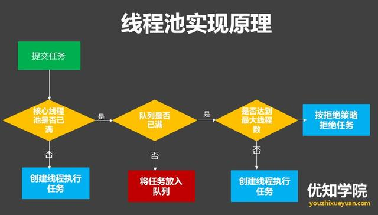

## 高并发编程系列：线程池的使用方式，核心运行原理、以及注意事项
### 线程池的缘由
java中为了提高并发度，可以使用多线程共同执行,但是如果有大量线程短时间之内被创建和销毁，会占用大量的系统时间，影响系统效率。

为了解决上面的问题，java中引入了线程池，可以使创建好的线程在指定的时间内由系统统一管理，而不是在执行时创建，执行后就销毁，从而避免了频繁创建、销毁线程带来的系统开销。

线程池如何使用，以及实现原理，处理步骤，有什么使用注意事项等，今天主要从这几个方面详细介绍Java线程池。



### 线程池的处理流程
就以ThreadPoolExecutor为例，当我们把一个Runnable交给线程池去执行的时候，这个线程池处理的流程是这样的：



- 先判断线程池中的核心线程们是否空闲，如果空闲，就把这个新的任务指派给某一个空闲线程去执行。如果没有空闲，并且当前线程池中的核心线程数还小于 corePoolSize，那就再创建一个核心线程。
- 如果线程池的线程数已经达到核心线程数，并且这些线程都繁忙，就把这个新来的任务放到等待队列中去。如果等待队列又满了，那么查看一下当前线程数是否到达maximumPoolSize，如果还未到达，就继续创建线程。
- 如果已经到达了，就交给RejectedExecutionHandler(拒绝策略)来决定怎么处理这个任务。
 
### 线程池的使用(ThreadPoolExecutor)
在Java中，线程池的概念是Executor这个接口，具体实现为ThreadPoolExecutor类，是线程池中最核心的一个类，因此如果要透彻地了解Java中的线程池，必须先了解这个类。

ThreadPoolExecutor继承了AbstractExecutorService类，并提供了四个构造器：
````
public class ThreadPoolExecutor extends AbstractExecutorService {

…..

    public ThreadPoolExecutor(int corePoolSize,int maximumPoolSize,long keepAliveTime,TimeUnit unit,
    
    BlockingQueue<Runnable> workQueue);
    
    public ThreadPoolExecutor(int corePoolSize,int maximumPoolSize,long keepAliveTime,TimeUnit unit,
    
    BlockingQueue<Runnable> workQueue,ThreadFactory threadFactory);
    
    public ThreadPoolExecutor(int corePoolSize,int maximumPoolSize,long keepAliveTime,TimeUnit unit,
    
    BlockingQueue<Runnable> workQueue,RejectedExecutionHandler handler);
    
    public ThreadPoolExecutor(int corePoolSize,int maximumPoolSize,long keepAliveTime,TimeUnit unit,
    
    BlockingQueue<Runnable> workQueue,ThreadFactory threadFactory,RejectedExecutionHandler handler);

…

}
````
ThreadPoolExecutor继承了AbstractExecutorService类，并提供了四个构造器，事实上，通过观察每个构造器的源码具体实现，发现前面三个构造器都是调用的第四个构造器进行的初始化工作。

下面解释下一下构造器中各个参数的含义：

1. corePoolSize（线程池的基本大小）   
当提交一个任务到线程池时，线程池会创建一个线程来执行任务，即使其他空闲的基本线程能够执行新任务也会创建线程，等到需要执行的任务数大于线程池基本大小时就不再创建。如果调用了线程池的prestartAllCoreThreads方法，线程池会提前创建并启动所有基本线程。

2. runnableTaskQueue（任务队列）  
用于保存等待执行的任务的阻塞队列。可以选择以下几个阻塞队列。
    - ArrayBlockingQueue：是一个基于数组结构的有界阻塞队列，此队列按 FIFO（先进先出）原则对元素进行排序。
    - LinkedBlockingQueue：一个基于链表结构的阻塞队列，此队列按FIFO （先进先出） 排序元素，吞吐量通常要高于ArrayBlockingQueue。
    - SynchronousQueue：一个不存储元素的阻塞队列。每个插入操作必须等到另一个线程调用移除操作，否则插入操作一直处于阻塞状态，吞吐量通常要高于LinkedBlockingQueue。
    - PriorityBlockingQueue：一个具有优先级得无限阻塞队列。
3. maximumPoolSize（线程池最大大小）     
线程池允许创建的最大线程数。如果队列满了，并且已创建的线程数小于最大线程数，则线程池会再创建新的线程执行任务。值得注意的是如果使用了无界的任务队列这个参数就没什么效果。

4. ThreadFactory：用于设置创建线程的工厂     
可以通过线程工厂给每个创建出来的线程设置更有意义的名字，Debug和定位问题时非常又帮助。

5. RejectedExecutionHandler（饱和策略）
当队列和线程池都满了，说明线程池处于饱和状态，那么必须采取一种策略处理提交的新任务。这个策略默认情况下是AbortPolicy，表示无法处理新任务时抛出异常。     
以下是JDK1.5提供的四种策略。
    - AbortPolicy：直接抛出异常。
    - CallerRunsPolicy：只用调用者所在线程来运行任务。
    - DiscardOldestPolicy：丢弃队列里最近的一个任务，并执行当前任务。
    - DiscardPolicy：不处理，丢弃掉。

    当然也可以根据应用场景需要来实现RejectedExecutionHandler接口自定义策略。如记录日志或持久化不能处理的任务。
6. keepAliveTime（线程活动保持时间）  
线程池的工作线程空闲后，保持存活的时间。所以如果任务很多，并且每个任务执行的时间比较短，可以调大这个时间，提高线程的利用率。

7. TimeUnit（线程活动保持时间的单位）    
天（DAYS），小时（HOURS），分钟（MINUTES），毫秒(MILLISECONDS)，微秒(MICROSECONDS, 千分之一毫秒)和毫微秒(NANOSECONDS, 千分之一微秒)。

### 线程池的注意事项
虽然线程池能大大提高服务器的并发性能，但使用它也会存在一定风险。与所有多线程应用程序一样，用线程池构建的应用程序容易产生各种并发问题，如对共享资源的竞争和死锁。此外，如果线程池本身的实现不健壮，或者没有合理地使用线程池，还容易导致与线程池有关的死锁、系统资源不足和线程泄漏等问题。

1) 建议使用new ThreadPoolExecutor(…)的方式创建线程池    
线程池的创建不应使用Executors 去创建，而应该通过 ThreadPoolExecutor
创建，这样可以让读者更加明确地知道线程池的参数设置、运行规则，规避资源耗尽的风险，这一点在也阿里巴巴JAVA开发手册中也有明确要求。这一点不容小觑，曾有同学因为线程池使用不当导致生产的同一台机器上部署的多个应用都因无法创建线程池而出现故障。

2) 合理设置线程数  
线程池的工作线程数设置应根据实际情况配置，CPU密集型业务（搜索、排序等）CPU空闲时间较少，线程数不能设置太多。   
如果是CPU密集型任务，就需要尽量压榨CPU，参考值可以设为 NCPU+1   
如果是IO密集型任务，参考值可以设置为2*NCPU   

3) 设置能代表具体业务的线程名称   
这样方便通过日志的线程名称识别所属业务。具体实现可以通过指定ThreadPoolExecutor的ThreadFactory参数。如使Spring提供的CustomizableThreadFactory。

以上就是Java线程池的详细介绍，除了从编程的角度应对高并发，更多还需要从架构设计的层面来应对高并发场景，例如：Redis缓存、MySQL数据库的优化、异步消息等