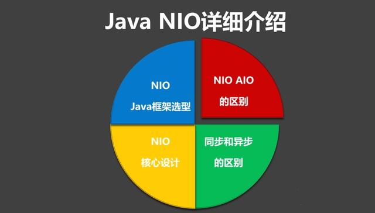
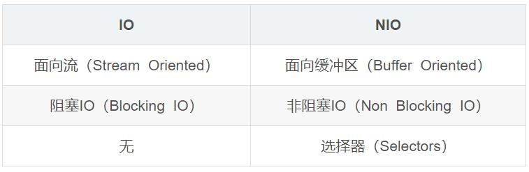

## 高并发编程系列：NIO、BIO、AIO的区别，及NIO的应用和框架选型


### AIO、BIO、NIO的区别
#### IO模型主要分类：

- 同步(synchronous) IO和异步(asynchronous) IO
- 阻塞(blocking) IO和非阻塞(non-blocking)IO
- 同步阻塞(blocking-IO)简称BIO
- 同步非阻塞(non-blocking-IO)简称NIO
- 异步非阻塞(synchronous-non-blocking-IO)简称AIO
#### 1.BIO (同步阻塞I/O模式)

数据的读取写入必须阻塞在一个线程内等待其完成。

这里使用那个经典的烧开水例子，这里假设一个烧开水的场景，有一排水壶在烧开水，BIO的工作模式就是， 叫一个线程停留在一个水壶那，直到这个水壶烧开，才去处理下一个水壶。但是实际上线程在等待水壶烧开的时间段什么都没有做。

#### 2.NIO（同步非阻塞）

同时支持阻塞与非阻塞模式，但这里我们以其同步非阻塞I/O模式来说明，那么什么叫做同步非阻塞？如果还拿烧开水来说，NIO的做法是叫一个线程不断的轮询每个水壶的状态，看看是否有水壶的状态发生了改变，从而进行下一步的操作。

#### 3.AIO （异步非阻塞I/O模型）

异步非阻塞与同步非阻塞的区别在哪里？异步非阻塞无需一个线程去轮询所有IO操作的状态改变，在相应的状态改变后，系统会通知对应的线程来处理。对应到烧开水中就是，为每个水壶上面装了一个开关，水烧开之后，水壶会自动通知我水烧开了。

#### 4.IO与NIO区别：



#### 5.同步与异步的区别：

同步：发送一个请求，等待返回，再发送下一个请求，同步可以避免出现死锁，脏读的发生。

异步：发送一个请求，不等待返回，随时可以再发送下一个请求，可以提高效率，保证并发。

#### 6.阻塞和非阻塞

阻塞：传统的IO流都是阻塞式的。也就是说，当一个线程调用read()或者write()方法时，该线程将被阻塞，直到有一些数据读读取或者被写入，在此期间，该线程不能执行其他任何任务。在完成网络通信进行IO操作时，由于线程会阻塞，所以服务器端必须为每个客户端都提供一个独立的线程进行处理，当服务器端需要处理大量的客户端时，性能急剧下降。

非阻塞：Java NIO是非阻塞式的。当线程从某通道进行读写数据时，若没有数据可用时，该线程会去执行其他任务。线程通常将非阻塞IO的空闲时间用于在其他通道上执行IO操作，所以单独的线程可以管理多个输入和输出通道。因此NIO可以让服务器端使用一个或有限几个线程来同时处理连接到服务器端的所有客户端。

#### 7.BIO、NIO、AIO适用场景

 BIO方式适用于连接数目比较小且固定的架构，这种方式对服务器资源要求比较高，并发局限于应用中，JDK1.4以前的唯一选择。
 
 NIO方式适用于连接数目多且连接比较短（轻操作）的架构，比如聊天服务器，并发局限于应用中，编程比较复杂。
 
 AIO方式使用于连接数目多且连接比较长（重操作）的架构，比如相册服务器，充分调用OS参与并发操作，编程比较复杂，JDK7开始支持。
 
### NIO的3个核心概念
NIO重点是把Channel（通道），Buffer（缓冲区），Selector（选择器）三个类之间的关系弄清楚。

#### 1.缓冲区Buffer

Buffer是一个对象。它包含一些要写入或者读出的数据。在面向流的I/O中，可以将数据写入或者将数据直接读到Stream对象中。

在NIO中，所有的数据都是用缓冲区处理。这也就本文上面谈到的IO是面向流的，NIO是面向缓冲区的。

缓冲区实质是一个数组，通常它是一个字节数组（ByteBuffer），也可以使用其他类的数组。但是一个缓冲区不仅仅是一个数组，缓冲区提供了对数据的结构化访问以及维护读写位置（limit）等信息。

最常用的缓冲区是ByteBuffer，一个ByteBuffer提供了一组功能于操作byte数组。除了ByteBuffer，还有其他的一些缓冲区，事实上，每一种Java基本类型（除了Boolean）都对应一种缓冲区，具体如下：

- ByteBuffer：字节缓冲区
- CharBuffer:字符缓冲区
- ShortBuffer：短整型缓冲区
- IntBuffer：整型缓冲区
- LongBuffer:长整型缓冲区
- FloatBuffer：浮点型缓冲区
- DoubleBuffer：双精度浮点型缓冲区
#### 2.通道Channel

Channel是一个通道，可以通过它读取和写入数据，他就像自来水管一样，网络数据通过Channel读取和写入。

通道和流不同之处在于通道是双向的，流只是在一个方向移动，而且通道可以用于读，写或者同时用于读写。

因为Channel是全双工的，所以它比流更好地映射底层操作系统的API，特别是在UNIX网络编程中，底层操作系统的通道都是全双工的，同时支持读和写。

Channel有四种实现：
- FileChannel:是从文件中读取数据。
- DatagramChannel:从UDP网络中读取或者写入数据。
- SocketChannel:从TCP网络中读取或者写入数据。
- ServerSocketChannel:允许你监听来自TCP的连接，就像服务器一样。每一个连接都会有一个SocketChannel产生。
#### 3.多路复用器Selector

Selector选择器可以监听多个Channel通道感兴趣的事情(read、write、accept(服务端接收)、connect，实现一个线程管理多个Channel，节省线程切换上下文的资源消耗。Selector只能管理非阻塞的通道，FileChannel是阻塞的，无法管理。

关键对象
- Selector：选择器对象，通道注册、通道监听对象和Selector相关。
- SelectorKey：通道监听关键字，通过它来监听通道状态。

监听注册

````
监听注册在Selector
socketChannel.register(selector, SelectionKey.OP_READ);
````
监听的事件有
- OP_ACCEPT: 接收就绪，serviceSocketChannel使用的
- OP_READ: 读取就绪，socketChannel使用
- OP_WRITE: 写入就绪，socketChannel使用
- OP_CONNECT: 连接就绪，socketChannel使用

### NIO的应用和框架


#### 1.NIO的应用

Java NIO成功的应用在了各种分布式、即时通信和中间件Java系统中，充分的证明了基于NIO构建的通信基础，是一种高效，且扩展性很强的通信架构。

例如：Dubbo(服务框架)，就默认使用Netty作为基础通信组件，用于实现各进程节点之间的内部通信。

Jetty、Mina、Netty、Dubbo、ZooKeeper等都是基于NIO方式实现。

- Mina出身于开源界的大牛Apache组织
- Netty出身于商业开源大亨Jboss
- Dubbo阿里分布式服务框架
#### 2.NIO框架

特别是Netty是目前最流行的一个Java开源框架NIO框架，Netty提供异步的、事件驱动的网络应用程序框架和工具，用以快速开发高性能、高可靠性的网络服务器和客户端程序。

相比JDK原生NIO，Netty提供了相对十分简单易用的API，非常适合网络编程。

Mina和Netty这两个NIO框架的创作者是同一个人Trustin Lee 。Netty从某种程度上讲是Mina的延伸和扩展，解决了一些Mina上的设计缺陷，也优化了一下Mina上面的设计理念。

另一方面Netty相比较Mina的优势：

- 更容易学习
- API更简单
- 详细的范例源码和API文档
- 更活跃的论坛和社区
- 更高的代码更新维护速度

Netty无疑是NIO框架的首选，它的健壮性、功能、性能、可定制性和可扩展性在同类框架都是首屈一指的，后续将重点详细谈Netty的实现原理以及实战场景。