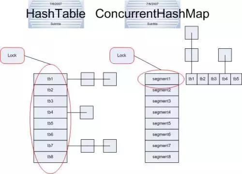

## 并发容器的由来
在Java并发编程中，经常听到Java集合类，同步容器、并发容器，那么他们有哪些具体分类，以及各自之间的区别和优劣呢？

只有把这些梳理清楚了，你才能真正掌握在高并发的环境下，正确使用好并发容器，我们先从Java集合类，同步容器谈起。

### 1.什么是同步容器

Java的集合容器框架中，主要有四大类别：List、Set、Queue、Map，大家熟知的这些集合类ArrayList、LinkedList、HashMap这些容器都是非线程安全的。

如果有多个线程并发地访问这些容器时，就会出现问题。因此，在编写程序时，在多线程环境下必须要求程序员手动地在任何访问到这些容器的地方进行同步处理，这样导致在使用这些容器的时候非常地不方便。

所以，Java先提供了同步容器供用户使用。

同步容器可以简单地理解为通过synchronized来实现同步的容器，比如Vector、Hashtable以及SynchronizedList等容器。

### 2.同步容器，主要的分类

 Vector     
 Stack      
 HashTable      
 Collections.synchronized方法生成   
同步容器面临的问题
可以通过查看Vector，Hashtable等这些同步容器的实现代码，可以看到这些容器实现线程安全的方式就是将它们的状态封装起来，并在需要同步的方法上加上关键字synchronized。

这样做的代价是削弱了并发性，当多个线程共同竞争容器级的锁时，吞吐量就会降低。

例如： HashTable只要有一条线程获取了容器的锁之后，其他所有的线程访问同步函数都会被阻塞，因此同一时刻只能有一条线程访问同步函数。

因此为了解决同步容器的性能问题，所以才有了并发容器。

### 什么是并发容器
java.util.concurrent包中提供了多种并发类容器。

并发类容器是专门针对多线程并发设计的，使用了锁分段技术，只对操作的位置进行同步操作，但是其他没有操作的位置其他线程仍然可以访问，提高了程序的吞吐量。

采用了CAS算法和部分代码使用synchronized锁保证线程安全。

### 并发容器有哪些分类
高并发编程系列：并发容器的原理，7大并发容器详解、及使用场景
#### 1.ConcurrentHashMap

对应的非并发容器：HashMap

目标：代替Hashtable、synchronizedMap，支持复合操作

原理：JDK6中采用一种更加细粒度的加锁机制Segment“分段锁”，JDK8中采用CAS无锁算法。

#### 2.CopyOnWriteArrayList

对应的非并发容器：ArrayList

目标：代替Vector、synchronizedList

原理：利用高并发往往是读多写少的特性，对读操作不加锁，对写操作，先复制一份新的集合，在新的集合上面修改，然后将新集合赋值给旧的引用，并通过volatile 保证其可见性，当然写操作的锁是必不可少的了。

#### 3.CopyOnWriteArraySet

对应的非并发容器：HashSet

目标：代替synchronizedSet

原理：基于CopyOnWriteArrayList实现，其唯一的不同是在add时调用的是CopyOnWriteArrayList的addIfAbsent方法，其遍历当前Object数组，如Object数组中已有了当前元素，则直接返回，如果没有则放入Object数组的尾部，并返回。

#### 4.ConcurrentSkipListMap

对应的非并发容器：TreeMap

目标：代替synchronizedSortedMap(TreeMap)

原理：Skip list（跳表）是一种可以代替平衡树的数据结构，默认是按照Key值升序的。

#### 5.ConcurrentSkipListSet

对应的非并发容器：TreeSet

目标：代替synchronizedSortedSet

原理：内部基于ConcurrentSkipListMap实现

#### 6.ConcurrentLinkedQueue

不会阻塞的队列

对应的非并发容器：Queue

原理：基于链表实现的FIFO队列（LinkedList的并发版本）

#### 7.LinkedBlockingQueue、ArrayBlockingQueue、PriorityBlockingQueue

对应的非并发容器：BlockingQueue

特点：拓展了Queue，增加了可阻塞的插入和获取等操作

原理：通过ReentrantLock实现线程安全，通过Condition实现阻塞和唤醒

实现类：
- LinkedBlockingQueue：基于链表实现的可阻塞的FIFO队列
- ArrayBlockingQueue：基于数组实现的可阻塞的FIFO队列
- PriorityBlockingQueue：按优先级排序的队列
### ConcurrentHashMap的实现

HashMap,Hashtable与ConcurrentHashMap都是实现的哈希表数据结构，在随机读取的时候效率很高。

Hashtable实现同步是利用synchronized关键字进行锁定的，其是针对整张哈希表进行锁定的，即每次锁住整张表让线程独占，在线程安全的背后是巨大的浪费。

ConcurrentHashMap和Hashtable主要区别就是围绕着锁的粒度进行区别以及如何区锁定。

上图中，左边是Hashtable的实现方式，可以看到锁住整个哈希表；而右边则是ConcurrentHashMap的实现方式，单独锁住每一个桶（segment）.ConcurrentHashMap将哈希表分为16个桶（默认值），诸如get(),put(),remove()等常用操作只锁当前需要用到的桶,而size()才锁定整张表。

原来只能一个线程进入，现在却能同时接受16个写线程并发进入（写线程需要锁定，而读线程几乎不受限制）。

所以，才有了并发性的极大提升。

高并发编程，除了并发容器，还会涉及到并发工具类:CountDownLatch等，后续将详细的介绍并发工具类，以及ConcurrentHashMap的底层实现细节，不仅要知其然,还要知其所以然，这样才能更好的掌握好高并发编程。